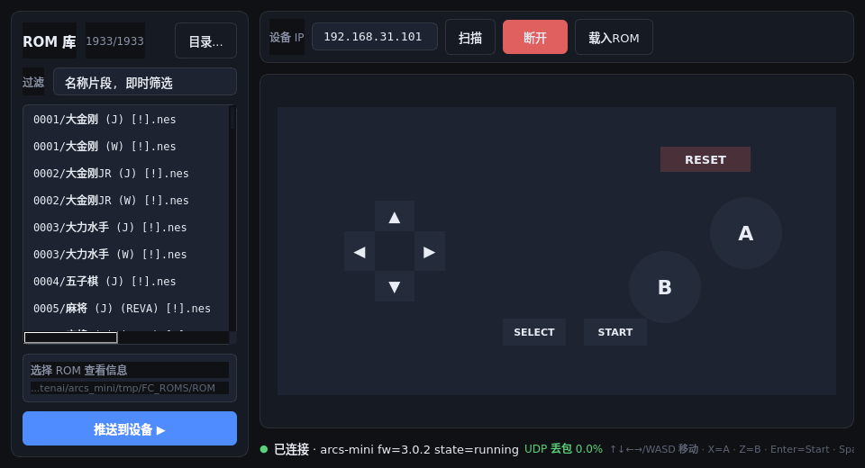

# ARCS-MINI NES 游戏机固件（nes/master 分支）

基于产品固件 master（mini-v3.0.2-m3）衍生的 **NES 游戏机** 分支：开机直接进入 NES
游戏屏，手机/电脑经 WiFi 充当无线手柄，支持运行期热切换游戏。
原语音助手产品说明见 [README-original.MD](README-original.MD)。

## 功能总览

| 功能 | 说明 |
| --- | --- |
| 开机进游戏 | 默认屏即 NES 游戏屏（`CONFIG_GAME_NES_ENABLE`），60fps 逻辑帧率 |
| ROM 内置 | 独立 flash 分区 `nes_rom`（0xE00000 / 1MB）XIP 直读，不占 PSRAM |
| ROM 热加载 | 经 WebSocket 推送 .nes 到设备，游戏运行中热切换重启（易失，重启回内置） |
| 无线手柄 | UDP 发现 + WebSocket 控制通道 + UDP 按键通道（低延迟 + 弱网自愈 + 丢包率显示） |
| 主机复位 | RESET 命令 / GUI 按钮 / R 键，重载当前 ROM |
| 稳定性 | 硬件看门狗常开；段错误打印 backtrace 后自动整机复位 |
| 按需裁剪 | 唤醒词、语音输出（提示音+TTS）已禁用，见「与产品分支的差异」 |

## 快速开始

### 构建

```bash
source ./arcs-sdk/env.sh                 # 工具链环境（首次）
./build.sh -S ./apps/arcs-mini -B build-nes -DBOARD=arcs_mini
```

### 烧录

```bash
./auto.sh                                # 一键：app + nes_rom 分区（推荐）
# 或
bash adb_download.sh -S res/arcs-mini -B build-nes app   # 仅 app
bash adb_download.sh -S res/arcs-mini -B build-nes       # 全量资源
```

### 连接手柄（PC 端）



`tools/pad_gui.py` 是仓库自带的 PC 端无线手柄（Qt，单文件无 UI 框架依赖）：

```bash
pip install websockets PyQt5                      # 依赖（PySide2 亦可）
python3 tools/pad_gui.py                          # 无参数 = 自动扫描并连接设备
python3 tools/pad_gui.py 192.168.31.101           # 指定 IP
python3 tools/pad_gui.py <IP> <ROM目录>           # 亦可指定 ROM 目录
```

界面分区（见上图）：

| 区域 | 功能 |
| --- | --- |
| 左侧 ROM 库 | 递归扫描目录（默认项目自带 `roms/`，「目录...」更换并记忆）；过滤框即时筛选 + 计数；选中显示大小 / mapper / PRG / CHR 信息；双击或「推送到设备 ▶」热切换游戏 |
| 顶部工具栏 | 设备 IP · 「扫描」UDP 广播发现 · 「连接/断开」 · 「载入ROM」文件选择推送 |
| 手柄画布 | 鼠标直接点按十字键 / A / B / SELECT / START（按住型，按键高亮反馈）；RESET 点击即主机复位 |
| 状态栏 | 连接状态 / 固件版本 / 帧率 / RTT / UDP 丢包率（绿 <1% / 黄 <5% / 红 ≥5%）；右侧快捷键提示 |

键盘映射（焦点在输入框时打字不触发手柄键，Enter/Esc 或点空白处返回按键捕获）：

| 键 | 手柄 | | 键 | 手柄 |
| --- | --- | --- | --- | --- |
| 方向键 / WASD | 十字键 | | Enter | START |
| X / K | A | | Space / Tab | SELECT |
| Z / J | B | | R | 主机复位 |
| 鼠标点按画布 | 任意按键 | | Esc | 退出程序 |

按键通道自动协商：固件 `welcome` 带 `udp_port` 时走 UDP 全量位图（低延迟 + 20Hz
重发弱网自愈），否则回退 WS 差分事件；WS 始终保留 ROM 推送 / 状态 / 命令。

Android 手机做手柄：按 `doc/gamepad-protocol.md` 实现客户端（BLE 配网 → UDP 发现 →
WS/UDP 按键）。

## 网络协议与端口

完整规范见 [doc/gamepad-protocol.md](doc/gamepad-protocol.md)。

| 端口 | 协议 | 用途 |
| --- | --- | --- |
| 38200 | TCP/WS | 控制通道：ROM 推送、状态/心跳、RESET/EXIT 命令 |
| 38201 | UDP | 设备发现（广播探测 → announce 应答） |
| 38202 | UDP | 按键通道（welcome 报文协商下发；全量位图 8 字节帧） |

## 更换内置 ROM

1. **检查**：iNES/NES2.0 格式、≤1MB、mapper 受支持（见下节）——
   用 `pad_gui` 选中看信息栏最快
2. **替换**：`cp 新ROM.nes res/arcs-mini/nes_rom.bin`
3. **烧录**：`./auto.sh` 或 `adb push 新ROM.nes /RAW/NAND/E00000` 后重启

只想试玩不必烧录：`pad_gui` 推送即可，重启自动回到内置 ROM。

## ROM 目录配置（pad_gui）

`pad_gui` 按以下优先级确定 ROM 库目录，选中一次后自动记忆，之后启动直达：

1. 启动参数：`python3 tools/pad_gui.py <设备IP> <ROM目录>`
2. 环境变量：`PAD_ROM_DIR=<ROM目录> python3 tools/pad_gui.py`
3. 上次记住的目录（`~/.config/arcs_pad_gui.json`）
4. 默认：项目自带 `apps-ui/apps/game/roms/`

任意 ROM 集合放进一个目录即可（支持子目录递归扫描，过滤框即时筛选），
用界面上的「目录...」按钮选中一次就行。**请只使用合法来源的 ROM**：
自制转储（自有卡带）、homebrew（NESdev 社区与 itch.io 上有大量优质免费作品，
如 Battle Kid、Legends of Owlia、Streemerz）、或已获授权的镜像。

## Mapper 支持范围

- **原生**：0 (NROM) / 1 (MMC1，含 CHR-RAM) / 2 (UNROM) / 3 (CNROM) / 7 (AxROM) /
  94 / 117 / 180
- **InfoNES 兼容层**：4 (MMC3) / 19 (Namco163) / 23,24,26 (Konami VRC 系) /
  8,9,10,13,15,16,18,21,22,25,30,32,33,34,40,41,42,64,65,67,68,69,73,75,76,79,80,
  88,89,90,95,105,108,109
- **不支持**：MMC5 (5)、VRC7 (85)、汉化常用 74/191 等

mapper 号在支持列表 ≠ 完美运行，实机试跑为准。

## 与产品分支（master）的差异

| 项 | 状态 | 恢复方式（apps/arcs-mini/prj.conf） |
| --- | --- | --- |
| 唤醒词引擎 | 已禁用（不拾音、不占 audio0 AEC） | `CONFIG_APP_WAKEUP_ENABLE=y` |
| 语音输出（提示音+TTS） | 已禁用（与游戏音频抢占有失真） | `CONFIG_APP_VOICE_OUTPUT_ENABLE=y` |
| 段错误 | 打印后自动复位（原为挂死） | 去掉 `CONFIG_EXCEPTION_REBOOT_IMMEDIATELY` |
| 渲染帧率 | 隔帧渲染 15fps（省 CPU，逻辑仍 60） | `CONFIG_GAME_NES_FRAME_SKIP=1`→30fps |
| 开机首屏 | NES 游戏屏 | 见 `apps-ui/apps/llm/lisa_ui_app.c` |

## 主要增量代码

```
apps-ui/apps/game/            NES 游戏屏（presenter + 设备/sim 双端口）
src/middleware/gamepad/       手柄中间件（发现/WS/UDP/ROM 暂存/输入位图）
tools/pad_gui.py              PC 端 Qt 手柄 GUI
doc/gamepad-protocol.md       协议规范
res/arcs-mini/nes_rom.bin     内置 ROM（nes_rom 分区内容）
arcs-sdk/.../nes/             SDK NES 核心（复用 demo，含 CHR-RAM 修复）
```
