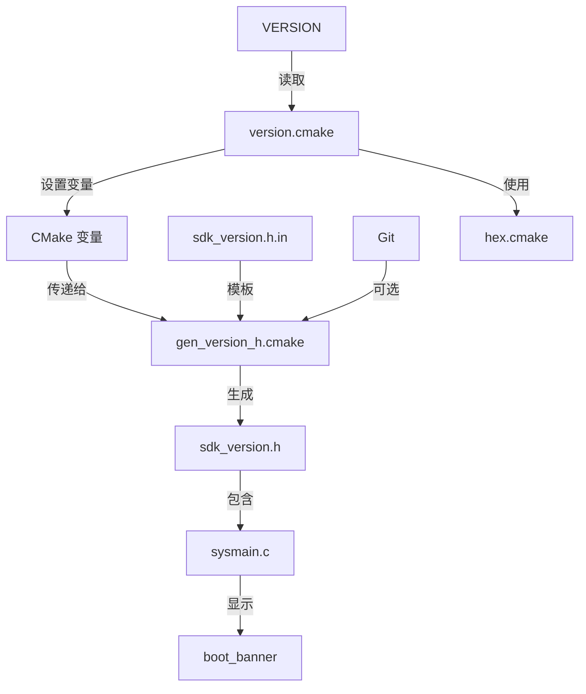

# ARCS SDK 版本管理说明

## 文档目的

本文档说明了 ARCS SDK 的版本管理机制和使用方法。

---

## 目录

1. [概述](#概述)
2. [版本号组成](#版本号组成)
3. [文件结构](#文件结构)
4. [数据流转](#数据流转)
5. [版本变量参考](#版本变量参考)
6. [构建集成](#构建集成)
7. [版本检查机制](#版本检查机制)
8. [使用示例](#使用示例)

---

## 概述

### 设计理念

- **单一数据源**: 所有版本号定义在单个纯文本文件 (`VERSION`) 中
- **多种表示形式**: 版本号以多种格式编码（字符串、整数、十六进制）
- **编译时生成**: 在 CMake 配置阶段生成版本头文件
- **Git 集成**: 可选的 git 提交哈希作为构建版本标识

### 主要特性

- 语义化版本控制，支持可选的 TWEAK 组件
- 额外版本后缀支持（如 `-rc1`、`-beta`）
- 为嵌入式系统提供十六进制版本编码
- 人类可读和机器可比较的格式
- 在 boot_banner 中自动显示版本信息

---

## 版本号组成

### 四级版本方案

```
MAJOR.MINOR.PATCH.TWEAK[-EXTRA]
  1  .  10 .  0  .  0   [-rc1]
  │     │     │     │      └─ 可选后缀（alpha、beta、rc1 等）
  │     │     │     └──────── 构建/微调版本号（通常为 0）
  │     │     └────────────── Bug 修复、补丁
  │     └──────────────────── 新功能（向后兼容）
  └────────────────────────── 破坏性变更
```

### 组件说明

| 组件 | 变量名 | 用途 | 何时递增 |
|-----------|---------------|---------|-------------------|
| MAJOR | `VERSION_MAJOR` | 破坏性 API 变更 | 引入 API 不兼容时 |
| MINOR | `VERSION_MINOR` | 新功能 | 添加向后兼容的新功能时 |
| PATCH | `PATCHLEVEL` | Bug 修复 | 仅修复 Bug 时 |
| TWEAK | `VERSION_TWEAK` | 构建/修订号 | 非常小的变更，通常为 0 |
| EXTRA | `EXTRAVERSION` | 预发布标签 | 预发布版本（rc1、beta 等） |

### 版本字符串格式

不同场景需要不同的版本表示形式:

| 格式 | 示例 | 用途 |
|--------|---------|-------|
| 标准（3 段） | `1.10.0` | 正式发布版本（TWEAK=0） |
| 完整（4 段） | `1.10.0.1` | 开发构建版本（TWEAK>0） |
| 带后缀 | `1.10.0-rc1` | 预发布版本 |
| 十六进制 | `0x010A00` | C 代码中的版本比较 |
| 整数 | `68096` | 数值比较 |

### 开发构建版本 vs 正式发布版本

通过 `VERSION_TWEAK` 和 `EXTRAVERSION` 区分不同阶段的版本：

| 版本类型 | TWEAK | EXTRAVERSION | 显示格式 | 使用场景 |
|---------|-------|--------------|----------|---------|
| 正式发布 | 0 | 0 | `1.10.0` | 对外发布的稳定版本 |
| 开发构建 | 1, 2, 3... | 0 | `1.10.0.1` | 日常开发、内部测试 |
| Alpha内测 | 0 | alpha | `1.10.0-alpha` | 早期内部测试 |
| Beta公测 | 0 | beta | `1.10.0-beta` | 公开测试版本 |
| RC候选 | 0 | rc1, rc2... | `1.10.0-rc1` | 发布前的候选版本 |

**典型版本演进流程**:
```
1.10.0.1 → 1.10.0.2 → ... → 1.10.0-alpha → 1.10.0-beta → 1.10.0-rc1 → 1.10.0
```

**版本显示规则**:
1. 如果设置了 `EXTRAVERSION`（非0），显示 `MAJOR.MINOR.PATCH-EXTRA`（忽略 TWEAK）
   - 示例: `TWEAK=1, EXTRAVERSION=rc1` → 显示 `1.10.0-rc1`
2. 如果设置了 `TWEAK`（非0），显示 `MAJOR.MINOR.PATCH.TWEAK`
   - 示例: `TWEAK=1, EXTRAVERSION=0` → 显示 `1.10.0.1`
3. 正式版本（TWEAK=0, EXTRAVERSION=0），显示 `MAJOR.MINOR.PATCH`
   - 示例: `TWEAK=0, EXTRAVERSION=0` → 显示 `1.10.0`

**注意**: `SDK_VERSION_NUMBER` 不包含 `TWEAK`，因此 `1.10.0` 和 `1.10.0.1` 的版本比较值相同。如需区分开发构建，使用 `SDKVERSION`（包含32位完整编码）。

---

## 文件结构

### 核心文件

```
arcs-sdk/
├── VERSION                           # [源文件] 版本定义文件
├── sdk_version.h.in            # [模板] C 头文件模板
├── cmake/
│   ├── version.cmake                # [解析器] 解析 VERSION 并设置变量
│   ├── gen_version_h.cmake          # [生成器] 生成 C 头文件
│   ├── hex.cmake                    # [工具] 十六进制转换函数
│   └── listenai-cmake-config.cmake  # [入口] 包含 version.cmake
└── startup/arcs/sysmain.c           # [使用] boot_banner 打印版本
```

### 文件关系图



---

## 数据流转

### 第 1 步: 版本定义（VERSION 文件）

**文件**: `VERSION`
**位置**: SDK 根目录
**格式**: 键值对

```makefile
VERSION_MAJOR = 1
VERSION_MINOR = 10
PATCHLEVEL = 0
VERSION_TWEAK = 0
EXTRAVERSION = 0
```

**规则**:
- 纯文本文件（非 YAML/JSON）
- 每行一个定义
- 仅数值（EXTRAVERSION 可以是字母数字）
- EXTRAVERSION: 正式版本使用 `0`，预发布版本使用 `rc1`/`beta`/`alpha`

### 第 2 步: 版本解析（version.cmake）

**文件**: `cmake/version.cmake`
**被包含于**: `cmake/listenai-cmake-config.cmake:58`

**处理流程**:

```cmake
# 1. 读取 VERSION 文件
file(READ ${ARCS_SDK_BASE}/VERSION ver)

# 2. 使用正则表达式解析每个组件
string(REGEX MATCH "VERSION_MAJOR = ([0-9]*)" _ ${ver})
set(PROJECT_VERSION_MAJOR ${CMAKE_MATCH_1})

string(REGEX MATCH "VERSION_MINOR = ([0-9]*)" _ ${ver})
set(PROJECT_VERSION_MINOR ${CMAKE_MATCH_1})

string(REGEX MATCH "PATCHLEVEL = ([0-9]*)" _ ${ver})
set(PROJECT_VERSION_PATCH ${CMAKE_MATCH_1})

string(REGEX MATCH "VERSION_TWEAK = ([0-9]*)" _ ${ver})
set(PROJECT_VERSION_TWEAK ${CMAKE_MATCH_1})

string(REGEX MATCH "EXTRAVERSION = ([a-z0-9]*)" _ ${ver})
set(PROJECT_VERSION_EXTRA ${CMAKE_MATCH_1})

# 3. 构建组合版本
set(PROJECT_VERSION_WITHOUT_TWEAK ${PROJECT_VERSION_MAJOR}.${PROJECT_VERSION_MINOR}.${PROJECT_VERSION_PATCH})

# 4. 处理 TWEAK（可选的第 4 段）
if(PROJECT_VERSION_TWEAK AND NOT PROJECT_VERSION_TWEAK EQUAL 0)
    set(PROJECT_VERSION ${PROJECT_VERSION_WITHOUT_TWEAK}.${PROJECT_VERSION_TWEAK})
else()
    set(PROJECT_VERSION ${PROJECT_VERSION_WITHOUT_TWEAK})
endif()

# 5. 构建版本字符串（用于显示）
if(PROJECT_VERSION_EXTRA AND NOT PROJECT_VERSION_EXTRA STREQUAL "0")
    set(SDK_VERSION_STRING "\"${PROJECT_VERSION_WITHOUT_TWEAK}-${PROJECT_VERSION_EXTRA}\"")
else()
    set(SDK_VERSION_STRING "\"${PROJECT_VERSION_WITHOUT_TWEAK}\"")
endif()
```

**重要提示**: `SDK_VERSION_STRING` 不包含 TWEAK，仅包含 EXTRA 后缀。

### 第 3 步: 数值编码

**目的**: 使 C 代码中能进行版本比较

```cmake
# 转换为整数（24 位编码: MAJOR.MINOR.PATCH）
# 格式: 0xMMNNPP (MM=主版本, NN=次版本, PP=补丁)
math(EXPR SDK_VERSION_NUMBER_INT "(${MAJOR} << 16) + (${MINOR} << 8) + (${PATCH})")

# 转换为十六进制字符串
to_hex(${SDK_VERSION_NUMBER_INT} SDK_VERSION_NUMBER)
# 结果: SDK_VERSION_NUMBER = "0x010A00" (版本 1.10.0)

# 包含 TWEAK 的完整版本（32 位编码）
# 格式: 0xMMNNPPTT (MM=主版本, NN=次版本, PP=补丁, TT=微调)
math(EXPR SDKVERSION_INT "(${MAJOR} << 24) + (${MINOR} << 16) + (${PATCH} << 8) + (${TWEAK})")
to_hex(${SDKVERSION_INT} SDKVERSION)
# 结果: SDKVERSION = "0x010A0000" (版本 1.10.0.0)
```

**编码对比**:

| 版本 | SDK_VERSION_NUMBER | SDKVERSION |
|---------|-------------------|------------|
| 1.10.0.0 | 0x010A00 (68096) | 0x010A0000 (17432576) |
| 1.10.1.0 | 0x010A01 (68097) | 0x010A0100 (17432832) |
| 2.0.0.0 | 0x020000 (131072) | 0x02000000 (33554432) |

### 第 4 步: Git 集成（gen_version_h.cmake）

**文件**: `cmake/gen_version_h.cmake`
**执行于**: `cmake/listenai-cmake-config.cmake:132-145`

```cmake
# 尝试获取 git 提交哈希
find_package(Git QUIET)
if(GIT_FOUND AND EXISTS ${ARCS_SDK_BASE}/.git)
  execute_process(
    COMMAND ${GIT_EXECUTABLE} describe --abbrev=12 --always
    WORKING_DIRECTORY ${ARCS_SDK_BASE}
    OUTPUT_VARIABLE BUILD_VERSION
    OUTPUT_STRIP_TRAILING_WHITESPACE
  )
endif()

# 从模板生成头文件
configure_file(${ARCS_SDK_BASE}/sdk_version.h.in ${OUT_FILE})
```

**Git describe 格式**:
- 有标签时: `v1.10.0-5-g8d2af741d`
  - `v1.10.0`: 最近的标签
  - `5`: 自标签以来的提交数
  - `g8d2af741d`: 提交哈希（12 个字符）
- 无标签时: `8d2af741d`（仅哈希）

### 第 5 步: 头文件生成（arcs_sdk_version.h.in）

**模板文件**: `sdk_version.h.in`
**生成文件**: `build/generated/include/sdk_version.h`

**模板内容**:

```c
#ifndef ARCS_SDK_VERSION_H
#define ARCS_SDK_VERSION_H

/* 版本号组件 */
#define SDK_VERSION_MAJOR   @SDK_VERSION_MAJOR@
#define SDK_VERSION_MINOR   @SDK_VERSION_MINOR@
#define SDK_PATCHLEVEL      @SDK_PATCHLEVEL@

/* 版本字符串（用于显示） */
#define SDK_VERSION_STRING  @SDK_VERSION_STRING@

/* 数值版本编码（用于版本比较） */
#define SDK_VERSION_CODE    @SDK_VERSION_CODE@
#define SDK_VERSION_NUMBER  @SDK_VERSION_NUMBER@
#define SDKVERSION          @SDKVERSION@

/* 构建版本信息（Git 提交哈希） */
#define BUILD_VERSION       "@BUILD_VERSION@"

/* 版本比较宏 */
#define SDK_VERSION(a, b, c) (((a) << 16) + ((b) << 8) + (c))

#endif /* ARCS_SDK_VERSION_H */
```

**生成的输出**（版本 1.10.0）:

```c
#ifndef ARCS_SDK_VERSION_H
#define ARCS_SDK_VERSION_H

#define SDK_VERSION_MAJOR   1
#define SDK_VERSION_MINOR   10
#define SDK_PATCHLEVEL      0
#define SDK_VERSION_STRING  "1.10.0"
#define SDK_VERSION_CODE    68096
#define SDK_VERSION_NUMBER  0x010A00
#define SDKVERSION          0x010A0000
#define BUILD_VERSION       "8d2af741d"
#define SDK_VERSION(a, b, c) (((a) << 16) + ((b) << 8) + (c))

#endif /* ARCS_SDK_VERSION_H */
```

### 第 6 步: 构建执行（listenai-cmake-config.cmake）

**文件**: `cmake/listenai-cmake-config.cmake:132-145`

```cmake
# 生成 SDK 版本文件
execute_process(
    COMMAND ${CMAKE_COMMAND}
        -DARCS_SDK_BASE=${ARCS_SDK_BASE}
        -DOUT_FILE=${CMAKE_BINARY_DIR}/generated/include/sdk_version.h
        -DSDK_VERSION_MAJOR=${SDK_VERSION_MAJOR}
        -DSDK_VERSION_MINOR=${SDK_VERSION_MINOR}
        -DSDK_PATCHLEVEL=${SDK_PATCHLEVEL}
        -DSDK_VERSION_STRING=${SDK_VERSION_STRING}
        -DSDK_VERSION_CODE=${SDK_VERSION_CODE}
        -DSDK_VERSION_NUMBER=${SDK_VERSION_NUMBER}
        -DSDKVERSION=${SDKVERSION}
        -P ${ARCS_SDK_BASE}/cmake/gen_version_h.cmake
    WORKING_DIRECTORY ${PROJECT_BINARY_DIR}
)
```

---

## 版本变量参考

### 完整变量列表

| 变量名 | 来源 | 类型 | 示例 | 描述 |
|--------------|--------|------|---------|-------------|
| `VERSION_MAJOR` | VERSION 文件 | 整数 | `1` | 主版本号 |
| `VERSION_MINOR` | VERSION 文件 | 整数 | `10` | 次版本号 |
| `PATCHLEVEL` | VERSION 文件 | 整数 | `0` | 补丁级别 |
| `VERSION_TWEAK` | VERSION 文件 | 整数 | `0` | 微调/构建号 |
| `EXTRAVERSION` | VERSION 文件 | 字符串 | `0` 或 `rc1` | 额外版本后缀 |
| `PROJECT_VERSION_MAJOR` | 解析后 | 整数 | `1` | 同 VERSION_MAJOR |
| `PROJECT_VERSION_MINOR` | 解析后 | 整数 | `10` | 同 VERSION_MINOR |
| `PROJECT_VERSION_PATCH` | 解析后 | 整数 | `0` | 同 PATCHLEVEL |
| `PROJECT_VERSION_TWEAK` | 解析后 | 整数 | `0` | 同 VERSION_TWEAK |
| `PROJECT_VERSION_EXTRA` | 解析后 | 字符串 | `0` 或 `rc1` | 同 EXTRAVERSION |
| `PROJECT_VERSION_WITHOUT_TWEAK` | 计算得出 | 字符串 | `1.10.0` | MAJOR.MINOR.PATCH |
| `PROJECT_VERSION` | 计算得出 | 字符串 | `1.10.0` 或 `1.10.0.1` | TWEAK 非零时包含 |
| `PROJECT_VERSION_STR` | 计算得出 | 字符串 | `1.10.0` 或 `1.10.0-rc1` | EXTRA 存在时包含 |
| `SDK_VERSION_MAJOR` | 导出 | 整数 | `1` | 用于 C 头文件 |
| `SDK_VERSION_MINOR` | 导出 | 整数 | `10` | 用于 C 头文件 |
| `SDK_PATCHLEVEL` | 导出 | 整数 | `0` | 用于 C 头文件 |
| `SDK_VERSION_STRING` | 导出 | 带引号字符串 | `"1.10.0"` | 用于 C 头文件（带引号） |
| `SDK_VERSION_NUMBER_INT` | 计算得出 | 整数 | `68096` | 十进制: (1<<16)+(10<<8)+0 |
| `SDK_VERSION_NUMBER` | 计算得出 | 十六进制字符串 | `0x010A00` | 十六进制编码（24 位） |
| `SDKVERSION_INT` | 计算得出 | 整数 | `17432576` | 包含 TWEAK 的十进制 |
| `SDKVERSION` | 计算得出 | 十六进制字符串 | `0x010A0000` | 十六进制编码（32 位） |
| `BUILD_VERSION` | Git | 字符串 | `8d2af741d` | Git 提交哈希 |
| `SDK_VERSION_CODE` | 别名 | 整数 | `68096` | 同 SDK_VERSION_NUMBER_INT |

### 变量使用场景

| 场景 | 使用的变量 |
|---------|---------------|
| CMake 构建消息 | `PROJECT_VERSION_STR` |
| C/C++ 版本检查 | `SDK_VERSION_NUMBER`, `SDKVERSION` |
| 显示给用户 | `SDK_VERSION_STRING`, `BUILD_VERSION` |
| 版本比较 | `SDK_VERSION_MAJOR/MINOR/PATCHLEVEL` |
| 宏计算 | `SDK_VERSION(a,b,c)` 宏 |

---

## 构建集成

### CMake 包含链

```
listenai-cmake-config.cmake (主配置)
    ├─> cmake/hex.cmake (十六进制工具)
    ├─> cmake/version.cmake (版本解析)
    └─> cmake/gen_version_h.cmake (头文件生成)
```

### 构建时执行顺序

1. **配置阶段**:
   - 读取 `VERSION` 文件
   - 解析版本组件
   - 设置所有版本变量
   - 计算十六进制编码

2. **版本头文件生成**:
   - 获取 Git 哈希（如果在 Git 仓库中）
   - 生成 `sdk_version.h`

3. **编译阶段**:
   - C/C++ 文件包含 `sdk_version.h`
   - 编译时可使用版本宏

### 控制台输出示例

构建时会看到:

```
-- arcs_sdk: 1.10.0 (/path/to/arcs-sdk)
```

这来自 `cmake/version.cmake:65`:

```cmake
if(NOT NO_PRINT_VERSION)
    message(STATUS "arcs_sdk: ${PROJECT_VERSION_STR} (${ARCS_SDK_BASE})")
endif()
```

---

## 版本检查机制

### C 代码版本检查

应用程序可以在编译时检查版本:

```c
#include "sdk_version.h"

#if SDK_VERSION_NUMBER < SDK_VERSION(1, 9, 0)
    #error "此代码需要 SDK 1.9.0 或更高版本"
#endif

// 运行时检查
if (SDK_VERSION_NUMBER < SDK_VERSION(1, 10, 0)) {
    printf("警告: SDK 版本 %s 低于推荐的 1.10.0\n",
           SDK_VERSION_STRING);
}
```

---

## 使用示例

### 启动横幅（boot_banner）

**文件**: `startup/arcs/sysmain.c`

```c
#include "sdk_version.h"

#if CONFIG_SYSLOG_BANNER
__attribute__((weak)) void boot_banner(void)
{
    printf("\n********Arcs SDK %s @ %s********\n",
           SDK_VERSION_STRING, BUILD_VERSION);
    printf("Running on hart-id: %ld\n", (unsigned long)__get_hart_id());
}
#endif
```

**输出示例**:
```
********Arcs SDK "1.10.0" @ 8d2af741d********
Running on hart-id: 0
```

### 版本号比较

```c
#include "sdk_version.h"

void check_sdk_version(void) {
    // 方法 1: 使用宏比较
    #if SDK_VERSION_NUMBER >= SDK_VERSION(1, 10, 0)
        printf("SDK 版本满足要求\n");
    #else
        #error "需要 SDK 1.10.0 或更高版本"
    #endif

    // 方法 2: 运行时比较
    if (SDK_VERSION_CODE >= SDK_VERSION(1, 10, 0)) {
        printf("当前 SDK 版本: %s\n", SDK_VERSION_STRING);
        printf("构建版本: %s\n", BUILD_VERSION);
    }
}
```

---

## 修改版本号

### 发布新版本

1. 编辑 `VERSION` 文件:
   ```
   VERSION_MAJOR = 1
   VERSION_MINOR = 11
   PATCHLEVEL = 0
   VERSION_TWEAK = 0
   EXTRAVERSION = 0
   ```

2. 重新配置构建:
   ```bash
   cd build
   cmake ..
   ```

3. 验证版本:
   ```bash
   # 查看生成的头文件
   cat build/generated/include/sdk_version.h
   ```

### 预发布版本

对于 rc1 版本:
```
VERSION_MAJOR = 1
VERSION_MINOR = 11
PATCHLEVEL = 0
VERSION_TWEAK = 0
EXTRAVERSION = rc1
```

生成的版本字符串: `"1.11.0-rc1"`

---

## 故障排查

### 常见问题

| 问题 | 原因 | 解决方案 |
|---------|-------|----------|
| 版本显示为 0.0.0 | VERSION 文件未找到或格式错误 | 检查 VERSION 文件路径和格式 |
| 十六进制版本为 0x0 | hex.cmake 未包含 | 验证在使用前 `include(hex.cmake)` |
| Git 哈希为空 | 不是 git 仓库或未安装 git | 正常行为，BUILD_VERSION 将为 "unknown" |
| 头文件未重新生成 | CMake 缓存问题 | 删除构建目录并重新配置 |

### 调试版本变量

在 `version.cmake` 中添加以下内容用于调试:

```cmake
message(STATUS "--- 版本调试信息 ---")
message(STATUS "PROJECT_VERSION: ${PROJECT_VERSION}")
message(STATUS "SDK_VERSION_STRING: ${SDK_VERSION_STRING}")
message(STATUS "SDK_VERSION_NUMBER: ${SDK_VERSION_NUMBER}")
message(STATUS "SDKVERSION: ${SDKVERSION}")
message(STATUS "BUILD_VERSION: ${BUILD_VERSION}")
message(STATUS "-------------------------")
```

---

## 文件快速参考

| 文件 | 目的 | 何时修改 |
|------|---------|---------------|
| `VERSION` | 定义版本号 | 每次发布 |
| `cmake/version.cmake` | 解析和设置变量 | 添加新版本格式时 |
| `cmake/hex.cmake` | 十六进制转换工具 | 很少（稳定工具） |
| `cmake/gen_version_h.cmake` | 生成 C 头文件 | 更改 git 集成时 |
| `sdk_version.h.in` | C 头文件模板 | 添加新 C 宏时 |
| `cmake/listenai-cmake-config.cmake` | 集成版本管理 | 更改构建流程时 |
| `startup/arcs/sysmain.c` | 显示启动横幅 | 更改显示格式时 |

---

## 附录

### 相关文件
- 版本定义: [VERSION](VERSION)
- 版本解析: [cmake/version.cmake](cmake/version.cmake)
- 头文件模板: [sdk_version.h.in](sdk_version.h.in)
- 头文件生成: [cmake/gen_version_h.cmake](cmake/gen_version_h.cmake)

### 文档信息
- **文档版本**: 1.0
- **SDK 版本**: ARCS SDK v1.10.0
- **最后更新**: 2025-12-01
