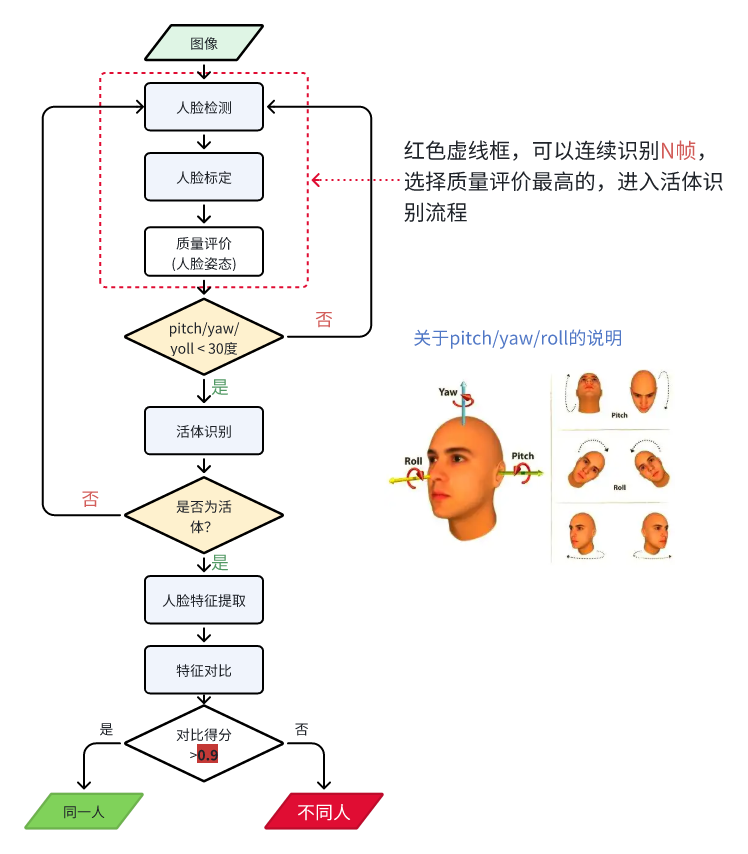

人脸识别组件
==============

简介
----

ACOMP FD (Face Detection) 是 ARCS SDK 的人脸识别组件，提供基于图像流的人脸检测、对齐、活体检测和特征提取功能。该组件支持多种图像格式输入，提供灵活的参数配置和事件回调机制。

主要特性
--------

- **完整人脸识别流程**：支持人脸检测、对齐、活体检测、特征提取和特征比对
- **多格式图像输入**：支持 YUYV422、RGB565、BGR888 等多种图像格式，最大支持640*480分辨率
- **活体检测**：支持活体检测功能，可配置活体检测阈值
- **人脸特征管理**：支持人脸特征导入和比对，最多支持 10 个注册人脸
- **事件回调机制**：支持人脸识别结果、错误事件等多种事件通知
- **图像流管理**：提供完整的图像流通道管理和缓冲区操作接口
- **状态管理**：支持初始化、就绪、启动、停止等完整的生命周期管理
- **跨核通信**：基于 IPC 机制实现图像流的跨核传输

人脸识别基本流程
----------------

人脸识别基本流程如下图所示，实际根据业务需求，流程可能会有所不同：

组件架构
--------

ACOMP FD 组件采用双核异构架构，CP 核(应用核)通过 ACOMP IPC 框架与 AP 核(算法核)进行通信，实现人脸识别功能。

.. code-block:: text

   ┌─────────────────────────────────────────────────────────────────────┐
   │                        CP 核 (Application Core)                      │
   │                                                                       │
   │  ┌──────────────────────────────────────────────────────────────┐   │
   │  │                      用户应用层                               │   │
   │  │  ┌────────────────────────────────────────────────────────┐  │   │
   │  │  │  • 人脸识别事件回调处理 (检测结果/特征/活体)           │  │   │
   │  │  │  • 图像数据采集 (摄像头/图像文件)                      │  │   │
   │  │  │  • 人脸特征管理 (注册/比对)                            │  │   │
   │  │  └────────────────────┬───────────────────────────────────┘  │   │
   │  └───────────────────────┼──────────────────────────────────────┘   │
   │                          │                                           │
   │  ┌───────────────────────▼──────────────────────────────────────┐   │
   │  │              ACOMP FD 组件 (CP 侧)                           │   │
   │  │  ┌──────────────┐  ┌──────────────┐  ┌──────────────┐       │   │
   │  │  │ 生命周期管理 │  │ 事件回调管理 │  │ 参数配置接口 │       │   │
   │  │  │ init/prepare │  │ add_callback │  │ params_set/  │       │   │
   │  │  │ start/stop   │  │ remove_cb    │  │ live_detect  │       │   │
   │  │  └──────┬───────┘  └──────┬───────┘  └──────┬───────┘       │   │
   │  │         │                 │                 │                │   │
   │  │  ┌──────▼─────────────────▼─────────────────▼───────┐       │   │
   │  │  │          图像流管理 (Stream API)                 │       │   │
   │  │  │  • M2R 流: 图像输入 (camera → 算法)             │       │   │
   │  │  │  • tx_alloc/submit                              │       │   │
   │  │  └──────────────────────┬───────────────────────────┘       │   │
   │  └─────────────────────────┼──────────────────────────────────┘   │
   │                            │                                         │
   │  ┌─────────────────────────▼─────────────────────────────────────┐  │
   │  │                   ACOMP IPC 层 (CP 侧)                        │  │
   │  │  • IPC 消息封装 (NEW/FREE/CONTROL/NOTIFY)                     │  │
   │  │  • 设备查询和管理                                             │  │
   │  │  • 同步/异步命令处理                                          │  │
   │  └─────────────────────────┬─────────────────────────────────────┘  │
   └────────────────────────────┼────────────────────────────────────────┘
                                │
                                │ IC Message (IPC 消息通道)
                                │
   ┌────────────────────────────▼────────────────────────────────────────┐
   │                        AP 核 (Algorithm Core)                        │
   │                                                                       │
   │  ┌─────────────────────────────────────────────────────────────┐    │
   │  │                   ACOMP Framework (AP 侧)                    │    │
   │  │                                                               │    │
   │  │  • 接收 CP 核的 IPC 命令 (prepare/start/stop/control)        │    │
   │  │  • 处理图像流数据 (M2R 接收)                                 │    │
   │  │  • 执行人脸识别算法引擎                                      │    │
   │  │  • 推送识别结果到 CP 核 (检测框/特征/活体)                  │    │
   │  │                                                               │    │
   │  └─────────────────────────────────────────────────────────────┘    │
   │                                                                       │
   │  ┌─────────────────────────────────────────────────────────────┐    │
   │  │              人脸识别算法引擎 (FD Engine)                    │    │
   │  │                                                               │    │
   │  │  • 人脸检测 (Face Detection)                                 │    │
   │  │  • 人脸对齐 (Face Alignment) - 68个关键点                    │    │
   │  │  • 活体检测 (Liveness Detection)                             │    │
   │  │  • 特征提取 (Feature Extraction) - 384维特征                 │    │
   │  │  • 特征比对 (Feature Comparison)                             │    │
   │  │                                                               │    │
   │  └─────────────────────────────────────────────────────────────┘    │
   └─────────────────────────────────────────────────────────────────────┘

                       ┌─────────────────────────┐
                       │   共享内存 (Shared Mem)  │
                       │  ┌────────────────────┐  │
                       │  │ VirtQueue 环形缓冲 │  │
                       │  │ (Stream IPC 数据)  │  │
                       │  └────────────────────┘  │
                       └─────────────────────────┘

架构说明
~~~~~~~~

1. CP 核 (应用核) - 开放接口层
^^^^^^^^^^^^^^^^^^^^^^^^^^^^^^^

- **用户应用层**: 处理人脸识别事件，采集图像数据，管理人脸特征
- **ACOMP FD 组件**: 提供生命周期管理、事件回调、参数配置等 API
- **图像流管理**: 管理 M2R(Master to Remote) 图像数据流
- **ACOMP IPC 层**: 封装 IPC 消息，与 AP 核通信

2. AP 核 (算法核) - 算法实现层
^^^^^^^^^^^^^^^^^^^^^^^^^^^^^^^

- **ACOMP Framework**: 接收 IPC 命令，管理算法生命周期，处理图像流数据
- **人脸识别算法引擎**: 执行人脸检测、对齐、活体检测、特征提取和比对

.. note::

   AP 核的具体实现为闭源算法库，开发者只需关注 CP 核的 API 使用即可。

3. 通信机制
^^^^^^^^^^^

- **控制通道**: 通过 IC Message 传递控制命令 (prepare/start/stop/control)
- **数据通道**: 通过 VirtQueue 共享内存实现零拷贝图像流传输
- **事件通知**: AP 核通过 NOTIFY 消息主动推送识别结果到 CP 核

4. 数据流向
^^^^^^^^^^^

- **M2R 流**: CP 核采集的图像数据 (摄像头/文件) → AP 核算法引擎
- **事件流**: AP 核识别结果(检测框/特征/活体) → CP 核回调函数

图像数据结构
------------

输入图像数据结构
~~~~~~~~~~~~~~~~

.. code-block:: c

   typedef struct{
       acomp_fd_pixel_format format;    /* 像素格式 */
       uint32_t index;                   /* 帧索引号 */
       uint16_t width;                   /* 图像宽度（像素） */
       uint16_t height;                  /* 图像高度（像素） */
       uint32_t length;                  /* 图像数据长度（字节） */
       uint32_t resv[4];                 /* 保留字段 */
       uint8_t data[0];                  /* 图像数据 */
   } acomp_fd_input_frame_t;

支持的图像格式
~~~~~~~~~~~~~~

.. list-table::
   :header-rows: 1
   :widths: 30 30 40

   * - 格式
     - 说明
     - 数据大小 (320x240)
   * - ``PIX_FMT_BGR888``
     - BGR 24位真彩色
     - 230400 字节
   * - ``PIX_FMT_YUV422_YUYV_PACKED``
     - YUYV422 交织格式
     - 153600 字节
   * - ``PIX_FMT_RGB565``
     - RGB 16位高彩色
     - 153600 字节

人脸识别结果结构
~~~~~~~~~~~~~~~~

.. code-block:: c

   typedef struct {
       acomp_fd_rect_t                 face_rect;          /* 人脸检测矩形框 */
       float                           face_score;         /* 人脸检测得分 */
       acomp_fd_align_point_t          align_points[68];   /* 68个人脸关键点 */
       int                             n_align_point;      /* 关键点个数 */
       acomp_fd_head_pose_t            pose;               /* 头部姿态角度 */
       acomp_fd_live_detect_result_t   live_result;        /* 活体检测结果 */
       int                             face_id;            /* 人脸ID */
       float                           features[384];      /* 384维人脸特征 */
       int                             feature_cnt;        /* 特征维度 */
       float                           compare_scores[10]; /* 与注册人脸的比对得分 */
       int                             compare_cnt;        /* 已注册人脸数量 */
   } acomp_fd_result_t;

配置选项
--------

基本配置
~~~~~~~~

.. list-table::
   :header-rows: 1
   :widths: 40 40 20

   * - 配置项
     - 说明
     - 默认值
   * - ``CONFIG_ACOMP``
     - 启用ACOMP组件
     - n
   * - ``CONFIG_ACOMP_FD``
     - 启用ACOMP组件的人脸识别组件
     - n

资源配置
~~~~~~~~

.. list-table::
   :header-rows: 1
   :widths: 50 30 20

   * - 配置项
     - 说明
     - 默认值
   * - ``CONFIG_ACOMP_FD_RES_FACE_DETECT_ADDRESS``
     - 人脸检测模型地址(Flash)
     - 0x30100000
   * - ``CONFIG_ACOMP_FD_RES_FACE_DETECT_LENGTH``
     - 人脸检测模型长度
     - 450936
   * - ``CONFIG_ACOMP_FD_RES_FACE_ALIGN_ADDRESS``
     - 人脸对齐模型地址(Flash)
     - 0x30170000
   * - ``CONFIG_ACOMP_FD_RES_FACE_ALIGN_LENGTH``
     - 人脸对齐模型长度
     - 1588664
   * - ``CONFIG_ACOMP_FD_RES_FACE_LIVE_ADDRESS``
     - 活体检测模型地址(Flash)
     - 0x30300000
   * - ``CONFIG_ACOMP_FD_RES_FACE_LIVE_LENGTH``
     - 活体检测模型长度
     - 1095288
   * - ``CONFIG_ACOMP_FD_FACE_VERIFY_ADDRESS``
     - 特征提取模型地址(Flash)
     - 0x30410000
   * - ``CONFIG_ACOMP_FD_FACE_VERIFY_LENGTH``
     - 特征提取模型长度
     - 2953752

快速开始
--------

1. 启用组件
~~~~~~~~~~~

在项目的 ``prj.conf`` 文件中添加：

.. code-block:: kconfig

   # 启用 ACOMP 组件
   CONFIG_ACOMP=y

   # 启用ACOMP组件的FD组件
   CONFIG_ACOMP_FD=y

   # 配置人脸识别组件所需资源在flash的位置和大小
   CONFIG_ACOMP_FD_RES_FACE_DETECT_ADDRESS=0x30100000
   CONFIG_ACOMP_FD_RES_FACE_DETECT_LENGTH=450936
   CONFIG_ACOMP_FD_RES_FACE_ALIGN_ADDRESS=0x30170000
   CONFIG_ACOMP_FD_RES_FACE_ALIGN_LENGTH=1588664
   CONFIG_ACOMP_FD_RES_FACE_LIVE_ADDRESS=0x30300000
   CONFIG_ACOMP_FD_RES_FACE_LIVE_LENGTH=1095288
   CONFIG_ACOMP_FD_FACE_VERIFY_ADDRESS=0x30410000
   CONFIG_ACOMP_FD_FACE_VERIFY_LENGTH=2953752

2. 初始化人脸识别组件
~~~~~~~~~~~~~~~~~~~~~~

在应用程序中初始化人脸识别组件：

.. code-block:: c

   #include "acomp.h"
   #include "fd/acomp_fd.h"

   int main(int argc, char **argv)
   {
       // 初始化 ACOMP 框架
       acomp_init();
       
       // 初始化人脸识别组件
       int ret = acomp_fd_init();
       if (ret != ACOMP_ERR_OK) {
           printf("FD init failed: %d\n", ret);
           return -1;
       }
       
       // 你的应用代码
       return 0;
   }

3. 注册事件回调
~~~~~~~~~~~~~~~

使用事件回调函数接收人脸识别结果：

.. code-block:: c

   #include "fd/acomp_fd.h"

   void fd_event_handler(uint32_t event, void *event_data, 
                        uint32_t event_data_len, void *priv)
   {
       if (event & FD_CB_EVENT_ENGINE_RLT) {
           // 人脸识别结果
           acomp_fd_result_info_t *info = (acomp_fd_result_info_t *)event_data;
           
           if (info->results_cnt > 0) {
               uint32_t max_idx = info->max_area_results_index;
               acomp_fd_result_t *result = &info->results[max_idx];
               
               printf("Face detected: [%d,%d,%d,%d], score: %.2f\n",
                      result->face_rect.x, result->face_rect.y,
                      result->face_rect.w, result->face_rect.h,
                      result->face_score);
               
               printf("Head pose: yaw=%.1f, pitch=%.1f, roll=%.1f\n",
                      result->pose.yaw, result->pose.pitch, result->pose.roll);
               
               printf("Live detect: status=%d, score=%.2f\n",
                      result->live_result.status,
                      result->live_result.scores[1]);
           } else {
               printf("No face detected\n");
           }
       } else if (event & FD_CB_EVENT_ENGINE_WR_ERR) {
           // 写入错误
           printf("FD write error\n");
       }
   }

   // 注册回调
   int ret = acomp_fd_add_callback(
       FD_CB_EVENT_ENGINE_RLT | FD_CB_EVENT_ENGINE_WR_ERR,
       fd_event_handler, 
       NULL
   );

4. 启动人脸识别服务
~~~~~~~~~~~~~~~~~~~

完整的启动流程：

.. code-block:: c

   #include "fd/acomp_fd.h"

   void start_fd_service(void)
   {
       int ret;
       
       // 1. 就绪组件（分配资源）
       ret = acomp_fd_prepare();
       if (ret != ACOMP_ERR_OK) {
           printf("FD prepare failed: %d\n", ret);
           return;
       }
       
       // 2. 启动人脸识别
       ret = acomp_fd_start();
       if (ret != ACOMP_ERR_OK) {
           printf("FD start failed: %d\n", ret);
           return;
       }
       
       printf("FD service started\n");
   }

   void stop_fd_service(void)
   {
       int ret;
       
       // 1. 停止人脸识别
       ret = acomp_fd_stop();
       if (ret != ACOMP_ERR_OK) {
           printf("FD stop failed: %d\n", ret);
           return;
       }
       
       // 2. 清理资源
       ret = acomp_fd_cleanup();
       if (ret != ACOMP_ERR_OK) {
           printf("FD cleanup failed: %d\n", ret);
           return;
       }
       
       printf("FD service stopped\n");
   }

5. 配置活体检测参数
~~~~~~~~~~~~~~~~~~~

设置活体检测模式和阈值：

.. code-block:: c

   #include "fd/acomp_fd.h"

   void configure_live_detect(void)
   {
       // 配置活体检测
       acomp_fd_live_detect_mode_t mode = {
           .enable = true,         // 启用活体检测
           .score_threshold = {
               0.51,               // 假人阈值（未使用）
               0.1,                // 真人阈值（活体得分 >= 0.1 才进行特征提取）
           },
       };
       
       int ret = acomp_fd_live_detect_mode_set(&mode);
       if (ret != ACOMP_ERR_OK) {
           printf("Set live detect mode failed: %d\n", ret);
       }
   }

6. 创建图像输入流并发送图像数据
~~~~~~~~~~~~~~~~~~~~~~~~~~~~~~~

使能 M2R (Master to Remote) 流通道，用于将图像数据发送给 AP 核：

.. code-block:: c

   #include "fd/acomp_fd.h"

   #define TX_STREAM_CH_INDEX    0
   #define TX_STREAM_CH_NAME     "stream.fd_image"

   void setup_tx_stream(void)
   {
       // 1. 创建 M2R 流通道描述符
       acomp_stream_chn_create_desc_t desc = {
           .cname = TX_STREAM_CH_NAME,
           .direction = ACOMP_STREAM_DIRECTION_M2R,  // Master to Remote
           .index = TX_STREAM_CH_INDEX,
           .buffer_size = 320 * 240 * 2 + sizeof(acomp_fd_input_frame_t),
           .num_descs = 4,         // 缓冲区描述符数量
           .kick_policy = 1,       // 自动触发
       };
       
       // 2. 使能流通道
       int ret = acomp_fd_stream_ch_enable(TX_STREAM_CH_INDEX, &desc);
       if (ret != ACOMP_ERR_OK) {
           printf("Failed to enable tx stream: %d\n", ret);
       }
   }

   void send_image_to_fd(uint8_t *image_data, int width, int height, 
                         acomp_fd_pixel_format format)
   {
       uint8_t *buffer;
       uint32_t buf_size;
       uint16_t desc_idx;
       
       // 1. 分配发送缓冲区
       buffer = acomp_fd_stream_tx_buffer_alloc(TX_STREAM_CH_INDEX, 
                                                &buf_size, &desc_idx);
       if (buffer && buf_size > 0) {
           // 2. 填充图像帧数据
           acomp_fd_input_frame_t *frame = (acomp_fd_input_frame_t *)buffer;
           frame->format = format;
           frame->index = 0;
           frame->width = width;
           frame->height = height;
           frame->length = width * height * 2;  // YUYV422
           memcpy(frame->data, image_data, frame->length);
           
           // 3. 提交缓冲区发送
           acomp_fd_stream_tx_buffer_submit(TX_STREAM_CH_INDEX, 
                                            buffer, buf_size, desc_idx);
       }
   }

7. 人脸特征管理
~~~~~~~~~~~~~~~

导入人脸特征用于识别：

.. code-block:: c

   #include "fd/acomp_fd.h"

   void load_face_features(void)
   {
       // 准备人脸特征数据（特征可从人脸识别组件识别结果或文件或数据库读取）
       acomp_fd_feature_result_t features[3];  // 最多10个
       
       // 假设已经从某处获取了特征数据（特征可从人脸识别组件识别结果或文件或数据库读取）
       // load_features_from_storage(features, 3);
       
       // 导入特征到人脸识别组件
       int ret = acomp_fd_features_load(features, 3);
       if (ret != ACOMP_ERR_OK) {
           printf("Load features failed: %d\n", ret);
       } else {
           printf("Loaded 3 face features\n");
       }
   }

API 参考
--------

生命周期管理
~~~~~~~~~~~~

acomp_fd_init
^^^^^^^^^^^^^

.. code-block:: c

   int acomp_fd_init(void);

**功能**：初始化人脸识别组件

**返回值**：

- ``ACOMP_ERR_OK``：成功
- ``ACOMP_ERR_NO_MEM``：内存不足
- ``ACOMP_ERR_INVALID_STATE``：无效状态
- ``ACOMP_ERR_NOT_FOUND``：设备未找到

acomp_fd_prepare
^^^^^^^^^^^^^^^^

.. code-block:: c

   int acomp_fd_prepare(void);

**功能**：就绪人脸识别组件，初始化内存块及算法资源

**说明**：在调用 ``acomp_fd_start()`` 之前必须调用此函数

**返回值**：

- ``ACOMP_ERR_OK``：成功
- ``ACOMP_ERR_NO_MEM``：内存不足
- ``ACOMP_ERR_INVALID_STATE``：无效状态

acomp_fd_cleanup
^^^^^^^^^^^^^^^^

.. code-block:: c

   int acomp_fd_cleanup(void);

**功能**：复位人脸识别组件，释放内存块及算法资源

**返回值**：

- ``ACOMP_ERR_OK``：成功
- ``ACOMP_ERR_INVALID_STATE``：无效状态

acomp_fd_start
^^^^^^^^^^^^^^

.. code-block:: c

   int acomp_fd_start(void);

**功能**：启动人脸识别组件，开始处理图像流

**返回值**：

- ``ACOMP_ERR_OK``：成功
- ``ACOMP_ERR_NO_MEM``：内存不足
- ``ACOMP_ERR_INVALID_STATE``：无效状态

acomp_fd_stop
^^^^^^^^^^^^^

.. code-block:: c

   int acomp_fd_stop(void);

**功能**：停止人脸识别组件，停止处理图像流

**返回值**：

- ``ACOMP_ERR_OK``：成功
- ``ACOMP_ERR_INVALID_STATE``：无效状态

参数配置
~~~~~~~~

acomp_fd_params_set
^^^^^^^^^^^^^^^^^^^

.. code-block:: c

   int acomp_fd_params_set(const acomp_fd_param_t *params, uint32_t params_cnt);

**功能**：设置组件参数

**参数**：

- ``params``：参数数组指针
- ``params_cnt``：参数个数

**返回值**：

- ``ACOMP_ERR_OK``：成功
- ``ACOMP_ERR_INVALID_ARG``：参数错误
- ``ACOMP_ERR_INVALID_STATE``：无效状态

acomp_fd_live_detect_mode_set
^^^^^^^^^^^^^^^^^^^^^^^^^^^^^^

.. code-block:: c

   int acomp_fd_live_detect_mode_set(const acomp_fd_live_detect_mode_t *mode);

**功能**：设置活体检测模式

**参数**：

- ``mode``：活体检测配置

  - ``enable``：是否启用活体检测
  - ``score_threshold[1]``：真人得分阈值（活体得分 >= 此值才进行特征提取）

**返回值**：

- ``ACOMP_ERR_OK``：成功
- ``ACOMP_ERR_INVALID_ARG``：参数错误
- ``ACOMP_ERR_INVALID_STATE``：无效状态

acomp_fd_align_threshold_set
^^^^^^^^^^^^^^^^^^^^^^^^^^^^^

.. code-block:: c

   int acomp_fd_align_threshold_set(const acomp_fd_head_pose_t *threshold);

**功能**：设置人脸对齐的头部姿态阈值

**说明**：如果头部姿态角度超过阈值，将不进行活体检测和特征提取

**参数**：

- ``threshold``：头部姿态阈值

  - ``yaw``：偏航角阈值
  - ``pitch``：俯仰角阈值
  - ``roll``：翻滚角阈值

**返回值**：

- ``ACOMP_ERR_OK``：成功
- ``ACOMP_ERR_INVALID_ARG``：参数错误
- ``ACOMP_ERR_INVALID_STATE``：无效状态

acomp_fd_features_load
^^^^^^^^^^^^^^^^^^^^^^^

.. code-block:: c

   int acomp_fd_features_load(const acomp_fd_feature_result_t *features, uint32_t count);

**功能**：从外部导入人脸特征到注册库

**参数**：

- ``features``：人脸特征数组指针
- ``count``：特征个数（最多10个）

**返回值**：

- ``ACOMP_ERR_OK``：成功
- ``ACOMP_ERR_NO_MEM``：内存不足
- ``ACOMP_ERR_INVALID_ARG``：参数错误
- ``ACOMP_ERR_INVALID_STATE``：无效状态

事件回调
~~~~~~~~

acomp_fd_add_callback
^^^^^^^^^^^^^^^^^^^^^

.. code-block:: c

   int acomp_fd_add_callback(uint32_t events, fd_event_cb_t cb, void *priv);

**功能**：添加事件回调函数

**参数**：

- ``events``：事件位掩码，可同时注册多个事件

  - ``FD_CB_EVENT_ENGINE_RLT``：人脸识别结果返回
  - ``FD_CB_EVENT_ENGINE_WR_ERR``：算法引擎写入错误

- ``cb``：回调函数指针
- ``priv``：回调函数的私有数据指针

**返回值**：

- ``ACOMP_ERR_OK``：成功
- ``ACOMP_ERR_NO_MEM``：内存不足
- ``ACOMP_ERR_INVALID_ARG``：参数错误
- ``ACOMP_ERR_INVALID_STATE``：无效状态

acomp_fd_remove_callback
^^^^^^^^^^^^^^^^^^^^^^^^^

.. code-block:: c

   int acomp_fd_remove_callback(fd_event_cb_t cb);

**功能**：移除回调函数

**参数**：

- ``cb``：待移除的回调函数

**返回值**：

- ``ACOMP_ERR_OK``：成功
- ``ACOMP_ERR_INVALID_ARG``：参数错误
- ``ACOMP_ERR_INVALID_STATE``：无效状态
- ``ACOMP_ERR_NOT_SUPPORTED``：不支持的操作

图像流管理
~~~~~~~~~~

acomp_fd_stream_ch_enable
^^^^^^^^^^^^^^^^^^^^^^^^^^

.. code-block:: c

   int acomp_fd_stream_ch_enable(int chn, acomp_stream_chn_create_desc_t *desc);

**功能**：使能图像流通道

**参数**：

- ``chn``：通道索引
- ``desc``：通道描述符指针

**返回值**：

- ``ACOMP_ERR_OK``：成功
- ``ACOMP_ERR_INVALID_STATE``：无效状态
- ``ACOMP_ERR_INVALID_ARG``：参数错误
- ``ACOMP_ERR_CREATE_STREAM_FAILED``：创建流失败

acomp_fd_stream_ch_disable
^^^^^^^^^^^^^^^^^^^^^^^^^^^

.. code-block:: c

   int acomp_fd_stream_ch_disable(int chn);

**功能**：禁用图像流通道

**参数**：

- ``chn``：通道索引

**返回值**：

- ``ACOMP_ERR_OK``：成功
- ``ACOMP_ERR_INVALID_STATE``：无效状态
- ``ACOMP_ERR_INVALID_ARG``：参数错误

acomp_fd_stream_tx_buffer_alloc
^^^^^^^^^^^^^^^^^^^^^^^^^^^^^^^^

.. code-block:: c

   void* acomp_fd_stream_tx_buffer_alloc(int chn, uint32_t* len, uint16_t* desc_idx);

**功能**：分配 TX 流缓冲区用于向 AP 核发送图像数据

**参数**：

- ``chn``：通道索引
- ``len``：可用缓冲区长度指针（输出）
- ``desc_idx``：描述符索引指针（输出）

**返回值**：缓冲区指针，失败返回 NULL

acomp_fd_stream_tx_buffer_submit
^^^^^^^^^^^^^^^^^^^^^^^^^^^^^^^^^

.. code-block:: c

   int acomp_fd_stream_tx_buffer_submit(int chn, void* buffer, 
                                        uint32_t len, uint16_t desc_idx);

**功能**：提交 TX 流缓冲区发送图像数据到 AP 核

**参数**：

- ``chn``：通道索引
- ``buffer``：缓冲区指针
- ``len``：数据长度
- ``desc_idx``：描述符索引

**返回值**：

- ``ACOMP_ERR_OK``：成功
- ``ACOMP_ERR_INVALID_STATE``：无效状态
- ``ACOMP_ERR_INVALID_ARG``：参数错误

使用示例
--------

完整示例
~~~~~~~~

.. code-block:: c

   #include "acomp.h"
   #include "fd/acomp_fd.h"
   #include "lisa_log.h"

   #define TAG "fd_demo"

   // 事件回调函数
   void fd_event_handler(uint32_t event, void *event_data, 
                        uint32_t event_data_len, void *priv)
   {
       if (event & FD_CB_EVENT_ENGINE_RLT) {
           acomp_fd_result_info_t *info = (acomp_fd_result_info_t *)event_data;
           
           LISA_LOGI(TAG, "FD result: count=%d", info->results_cnt);
           
           if (info->results_cnt > 0) {
               uint32_t idx = info->max_area_results_index;
               acomp_fd_result_t *result = &info->results[idx];
               
               LISA_LOGI(TAG, "Face rect: [%d,%d,%d,%d], score: %.2f",
                        result->face_rect.x, result->face_rect.y,
                        result->face_rect.w, result->face_rect.h,
                        result->face_score);
               
               LISA_LOGI(TAG, "Head pose: yaw=%.1f, pitch=%.1f, roll=%.1f",
                        result->pose.yaw, result->pose.pitch, result->pose.roll);
               
               LISA_LOGI(TAG, "Live: status=%d, score=%.2f",
                        result->live_result.status,
                        result->live_result.scores[1]);
               
               if (result->compare_cnt > 0) {
                   LISA_LOGI(TAG, "Compare scores: [%.2f, %.2f]",
                            result->compare_scores[0],
                            result->compare_scores[1]);
               }
           }
       } else if (event & FD_CB_EVENT_ENGINE_WR_ERR) {
           LISA_LOGE(TAG, "FD write error");
       }
   }

   void fd_demo(void)
   {
       int ret;
       
       // 1. 初始化 ACOMP 框架
       acomp_init();
       
       // 2. 初始化人脸识别组件
       ret = acomp_fd_init();
       if (ret != ACOMP_ERR_OK) {
           LISA_LOGE(TAG, "FD init failed: %d", ret);
           return;
       }
       
       // 3. 注册事件回调
       ret = acomp_fd_add_callback(
           FD_CB_EVENT_ENGINE_RLT | FD_CB_EVENT_ENGINE_WR_ERR,
           fd_event_handler, 
           NULL
       );
       if (ret != ACOMP_ERR_OK) {
           LISA_LOGE(TAG, "Add callback failed: %d", ret);
           return;
       }
       
       // 4. 就绪组件
       ret = acomp_fd_prepare();
       if (ret != ACOMP_ERR_OK) {
           LISA_LOGE(TAG, "FD prepare failed: %d", ret);
           return;
       }
       LISA_LOGI(TAG, "FD prepared");
       
       // 5. 启动人脸识别
       ret = acomp_fd_start();
       if (ret != ACOMP_ERR_OK) {
           LISA_LOGE(TAG, "FD start failed: %d", ret);
           return;
       }
       LISA_LOGI(TAG, "FD started");
       
       // 6. 配置活体检测
       acomp_fd_live_detect_mode_t mode = {
           .enable = true,
           .score_threshold = {0.51, 0.1},
       };
       acomp_fd_live_detect_mode_set(&mode);
       
       // 7. 创建图像输入流
       acomp_stream_chn_create_desc_t desc = {
           .cname = "stream.fd_image",
           .direction = ACOMP_STREAM_DIRECTION_M2R,
           .index = 0,
           .buffer_size = 320 * 240 * 2 + sizeof(acomp_fd_input_frame_t),
           .num_descs = 4,
           .kick_policy = 1,
       };
       acomp_fd_stream_ch_enable(0, &desc);
       
       // 8. 发送图像数据（示例）
       // send_image_to_fd(...);
       
       // 9. 运行一段时间
       vTaskDelay(pdMS_TO_TICKS(10000));
       
       // 10. 停止人脸识别
       ret = acomp_fd_stop();
       if (ret != ACOMP_ERR_OK) {
           LISA_LOGE(TAG, "FD stop failed: %d", ret);
       }
       LISA_LOGI(TAG, "FD stopped");
       
       // 11. 清理资源
       ret = acomp_fd_cleanup();
       if (ret != ACOMP_ERR_OK) {
           LISA_LOGE(TAG, "FD cleanup failed: %d", ret);
       }
       LISA_LOGI(TAG, "FD cleaned up");
   }

图像流处理示例
~~~~~~~~~~~~~~

.. code-block:: c

   #include "fd/acomp_fd.h"

   void image_stream_tx_example(uint8_t *image_data, int width, int height)
   {
       int chn = 0;
       uint32_t len;
       uint16_t desc_idx;
       void *buffer;
       
       // 分配发送缓冲区
       buffer = acomp_fd_stream_tx_buffer_alloc(chn, &len, &desc_idx);
       if (buffer) {
           // 填充图像帧数据
           acomp_fd_input_frame_t *frame = (acomp_fd_input_frame_t *)buffer;
           frame->format = PIX_FMT_YUV422_YUYV_PACKED;
           frame->index = 0;
           frame->width = width;
           frame->height = height;
           frame->length = width * height * 2;
           memcpy(frame->data, image_data, frame->length);
           
           // 提交发送
           acomp_fd_stream_tx_buffer_submit(chn, buffer, len, desc_idx);
       }
   }

注意事项
--------

1. **初始化顺序**：必须先调用 ``acomp_init()`` 初始化 ACOMP 框架，再调用 ``acomp_fd_init()``
2. **生命周期管理**：启动前必须调用 ``acomp_fd_prepare()``，停止后应调用 ``acomp_fd_cleanup()`` 释放资源
3. **状态检查**：所有 API 都会进行状态检查，确保在正确的状态下调用相应的函数
4. **事件回调**：回调函数在组件内部线程中执行，应避免长时间阻塞操作
5. **内存管理**：组件使用动态内存分配，确保系统有足够的堆内存
6. **资源配置**：确保配置的模型地址和长度与实际烧录的模型匹配
7. **图像格式**：支持 YUYV422、RGB565、BGR888 等格式，推荐使用 YUYV422或RGB565 以节省内存
8. **活体检测阈值**：根据实际应用场景调整活体检测阈值，平衡误识率和拒识率
9. **特征管理**：最多支持 10 个注册人脸特征，每个特征为 384 维浮点数
10. **跨核通信**：图像流基于 IPC 机制，注意跨核数据传输的延迟和同步问题
11. **双核协作**：本组件运行在 CP 核，需要 AP 核提供算法支持，确保 AP 核固件正确烧录

常见问题
--------

**Q: 人脸识别组件初始化失败怎么办？**

A: 检查以下几点：

- 确保 ACOMP 框架已正确初始化
- 检查系统是否有足够的堆内存
- 确认 AP 核固件和算法模型已正确烧录到 Flash

**Q: 为什么没有检测到人脸？**

A: 可能的原因：

- 图像质量不佳（光线不足、模糊等）
- 人脸角度过大或遮挡严重
- 图像格式或尺寸不正确
- 检查回调函数是否正确注册

**Q: 活体检测总是失败怎么办？**

A: 建议：

- 调整活体检测阈值 ``score_threshold[1]`` （降低阈值更容易通过）
- 确保图像质量良好，光线充足
- 检查人脸是否正对摄像头，角度不要过大

**Q: 特征比对得分很低怎么办？**

A: 建议：

- 确保注册和识别时的图像质量一致
- 检查人脸角度和光线条件
- 特征比对阈值通常设置为 0.7-0.9，根据实际情况调整

**Q: 如何提高识别准确率？**

A: 建议：

- 使用高质量的图像输入（清晰、光线充足）
- 确保人脸正对摄像头，角度不要过大
- 注册多个角度的人脸特征
- 调整活体检测和特征比对阈值
