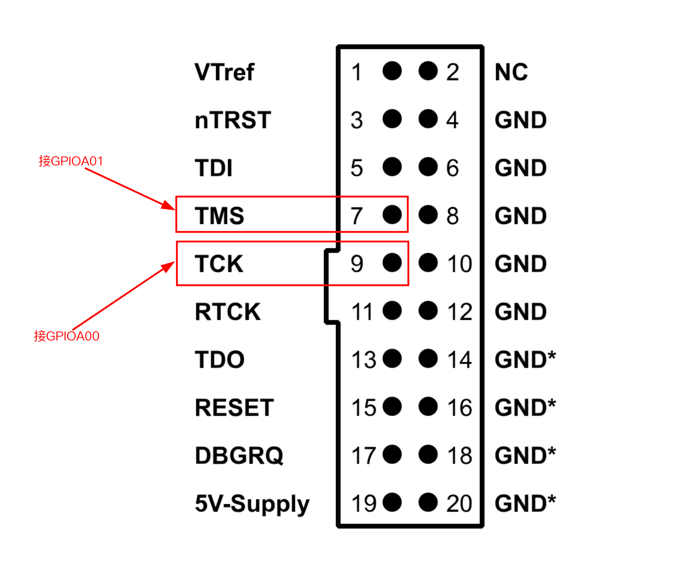

.. _gdb_debug:

================
GDB 调试指南
================

本文档介绍如何使用 GDB 调试 ARCS SDK 应用程序，包括环境配置、调试方式和常用命令。

.. note::
   ARCS SDK 使用 RISC-V 架构的 Nuclei 工具链，调试时需要使用对应的 GDB 工具。

.. _gdb_overview:

调试概述
========

GDB（GNU Debugger）是一个功能强大的调试工具，支持断点、单步执行、变量查看等调试功能。在嵌入式开发中，通常使用 GDB 配合 JTAG/SWD 调试器进行远程调试。

支持的调试方式
--------------

- **JTAG 调试**：通过 JTAG 接口连接调试器
- **远程 GDB 调试**：使用 GDB Server 进行远程调试
- **命令行调试**：使用 GDB 命令行界面进行调试

.. _gdb_preparation:

环境准备
========

安装调试工具
------------

1. **确认工具链安装**

   确保已按照 :ref:`getting_started` 中的步骤安装了 Nuclei 工具链。

2. **安装 J-Link 软件**

   从 `J-LINK <https://www.segger.com/downloads/jlink/>`_ 下载对应平台的 J-Link 软件包进行安装，推荐安装 V7.98 及以上版本。

   安装完成后，检查 J-Link 是否正常安装：

   .. code-block:: shell

      JLinkGDBServerCLExe --version

3. **配置 J-Link 设备支持**

   下载并安装 ARCS J-Link 设备配置文件：

   .. code-block:: shell

      curl -L -o /tmp/JLinkDevices.zip \
        http://listenai-firmware-delivery.oss-cn-beijing.aliyuncs.com/ARCS/tools/JLinkDevices.zip && \
        unzip -o /tmp/JLinkDevices.zip -d $HOME/.config/SEGGER

   检查 ARCS 设备是否正常识别：

   .. code-block:: shell

      JLinkGDBServerCLExe -device ARCS -if cJTAG -speed 4000 -port 2331 \
        -jlinkscriptfile $HOME/.config/SEGGER/JLinkDevices/scripts/arcs/jtagscan1.JLinkScript

   .. important::
      $HOME/.config/SEGGER/JLinkDevices/scripts/arcs目录下有两个脚本文件，

      jtagscan0.JLinkScript: 连接core0(AP核心)

      jtagscan1.JLinkScript: 连接core1(CP核心)

      请根据实际情况选择使用哪一个。

   .. note::
      SDK的示例代码如无特别说明外,默认都是在core1(CP核心)上运行的.

4. **验证 GDB 工具**

   检查 GDB 工具是否可用：

   .. code-block:: shell

      ${NUCLEI_TOOLCHAIN_PATH}/bin/riscv64-unknown-elf-gdb --version

   应该看到类似以下输出：

   .. code-block:: text

      GNU gdb (GDB) 13.2.90.20230712-git
      Copyright (C) 2023 Free Software Foundation, Inc.
      License GPLv3+: GNU GPL version 3 or later <http://gnu.org/licenses/gpl.html>
      This is free software: you are free to change and redistribute it.
      There is NO WARRANTY, to the extent permitted by law.

硬件要求
--------

.. important::
   需要 J-Link 仿真器 V11 或更高版本。

准备调试文件
------------

编译时需要生成包含调试信息的 ELF 文件：

.. code-block:: shell

   ./build.sh -S samples/helloworld -DBOARD=arcs_evb

编译成功后，在 ``build`` 目录下会生成：

- ``helloworld``：包含调试符号的可执行文件
- ``helloworld.bin``：用于烧录的二进制文件

.. note::
   默认情况下，SDK 编译生成的 ELF 文件已包含调试信息（``-g`` 选项）。

.. _gdb_debugging:

开始调试
========

硬件连接
--------

将 J-Link 仿真器连接到 ARCS 开发板：

调试步骤
--------

完整的 GDB 调试流程如下：

1. **启动 J-Link GDB Server**

   在终端中启动 J-Link GDB Server：

   .. code-block:: shell

      JLinkGDBServerCLExe -device ARCS -if cJTAG -speed 4000 -port 2331 \
        -jlinkscriptfile $HOME/.config/SEGGER/JLinkDevices/scripts/arcs/jtagscan1.JLinkScript

   成功启动后，GDB Server 会监听在 2331 端口。

2. **启动 GDB 并加载 ELF 文件**

   在另一个终端中启动 GDB：

   .. code-block:: shell

      ${NUCLEI_TOOLCHAIN_PATH}/bin/riscv64-unknown-elf-gdb build/helloworld

   启动后会进入 GDB 命令行界面：

   .. code-block:: text

      GNU gdb (GDB) 13.2.90.20230712-git
      ...
      Reading symbols from build/helloworld...
      (gdb)

3. **连接到 GDB Server**

   在 GDB 命令行中连接到 J-Link GDB Server：

   .. code-block:: text

      (gdb) target remote localhost:2331

   .. note::
      - 如果 GDB Server 运行在其他机器上，将 ``localhost`` 替换为对应的 IP 地址
      - 默认端口为 2331，如果使用其他端口，请相应修改

4. **加载程序到目标设备**

   连接成功后，将程序加载到目标设备：

   .. code-block:: text

      (gdb) load
      Loading section .text, size 0x1234 lma 0x20000000
      ...
      Start address 0x20000000, load size 4660
      Transfer rate: 1165 bytes/sec, 1165 bytes/write.

5. **开始调试**

   设置断点并运行程序：

   .. code-block:: text

      (gdb) break main
      Breakpoint 1 at 0x20000a34: file main.c, line 15.
      (gdb) continue
      Continuing.

快速调试脚本
------------

为了简化调试流程，可以创建一个 ``.gdbinit`` 文件来自动执行常用命令：

.. code-block:: text

   # 连接到 GDB Server
   target remote localhost:2331

.. note::
   出于安全考虑，GDB 可能不会自动加载当前目录的 ``.gdbinit`` 文件。可以在用户主目录的 ``~/.gdbinit`` 中添加：

   .. code-block:: text

      set auto-load safe-path /

.. _gdb_commands:

常用 GDB 命令
=============

本节介绍嵌入式调试中最常用的 GDB 命令。完整的 GDB 命令参考请查阅 :ref:`gdb_references`。

基本调试命令
------------

.. list-table::
   :header-rows: 1
   :widths: 30 70

   * - 命令
     - 说明
   * - ``break main``
     - 在 main 函数设置断点
   * - ``break main.c:25``
     - 在 main.c 第 25 行设置断点
   * - ``info breakpoints``
     - 查看所有断点
   * - ``delete 1``
     - 删除编号为 1 的断点
   * - ``continue`` (``c``)
     - 继续执行
   * - ``next`` (``n``)
     - 单步执行（不进入函数）
   * - ``step`` (``s``)
     - 单步执行（进入函数）
   * - ``finish``
     - 执行完当前函数并返回

查看变量和内存
--------------

.. code-block:: text

   (gdb) print variable_name           # 打印变量值（简写: p）
   (gdb) print /x variable_name        # 以十六进制打印
   (gdb) x/10xw 0x20000000             # 查看内存（10个字，十六进制）
   (gdb) display variable_name         # 每次停止时自动显示变量

调用栈和寄存器
--------------

.. code-block:: text

   (gdb) backtrace                     # 显示调用栈（简写: bt）
   (gdb) info locals                   # 显示局部变量
   (gdb) info registers                # 显示所有寄存器
   (gdb) print $pc                     # 打印程序计数器

实用命令
--------

.. code-block:: text

   (gdb) list                          # 查看源代码（简写: l）
   (gdb) info threads                  # 显示所有线程（RTOS 环境）
   (gdb) help                          # 显示帮助信息
   (gdb) quit                          # 退出 GDB（简写: q）

.. _gdb_examples:

调试示例
========

以调试 helloworld 示例为例，展示完整的调试流程：

1. **编译项目**

   .. code-block:: shell

      ./build.sh -C -S samples/helloworld -DBOARD=arcs_evb

2. **启动 J-Link GDB Server**

   参考 :ref:`gdb_debugging`

   .. code-block:: shell

      JLinkGDBServerCLExe -device ARCS -if cJTAG -speed 4000 -port 2331 -jlinkscriptfile $HOME/.config/SEGGER/JLinkDevices/scripts/arcs/jtagscan1.JLinkScript

3. **启动 GDB 并调试**

   .. code-block:: shell

      ${NUCLEI_TOOLCHAIN_PATH}/bin/riscv64-unknown-elf-gdb build/helloworld

   在 GDB 中执行：

   .. code-block:: text

      (gdb) target remote localhost:2331
      (gdb) break main
      (gdb) continue
      (gdb) next                          # 单步执行
      (gdb) print variable_name           # 查看变量
      (gdb) backtrace                     # 查看调用栈
      (gdb) info registers                # 查看寄存器

常见调试场景
------------

**内存问题调试**

.. code-block:: text

   (gdb) x/10xw $sp                    # 查看栈顶内存
   (gdb) x/20i $pc                     # 查看当前指令
   (gdb) watch *0x20001000             # 监视内存变化

**函数调用跟踪**

.. code-block:: text

   (gdb) break func_name
   (gdb) backtrace                     # 查看调用栈
   (gdb) info args                     # 查看函数参数
   (gdb) finish                        # 执行完函数

.. _gdb_tips:

调试技巧
========

条件断点和监视点
----------------

条件断点只在满足条件时才停止，监视点可以监视变量或内存的变化：

.. code-block:: text

   (gdb) break main.c:30 if counter > 100    # 条件断点
   (gdb) watch variable_name                 # 监视变量变化
   (gdb) watch *(int *)0x20000100            # 监视内存地址

查看汇编代码
------------

对于底层调试，可以查看汇编代码：

.. code-block:: text

   (gdb) disassemble main              # 反汇编 main 函数
   (gdb) disassemble /m main           # 混合显示源码和汇编
   (gdb) stepi                         # 汇编级单步执行

.. _gdb_troubleshooting:

常见问题
========

1. **找不到调试符号**

   问题现象：

   .. code-block:: text

      Reading symbols from build/helloworld...
      (No debugging symbols found)

   解决方法：

   - 确保编译时包含调试信息（``-g`` 选项）
   - 检查是否误用了 ``.bin`` 文件而非 ``.elf`` 文件

2. **无法连接到 GDB Server**

   问题现象：

   .. code-block:: text

      (gdb) target remote localhost:2331
      localhost:2331: Connection refused.

   解决方法：

   - 确认 J-Link GDB Server 已正确启动
   - 检查端口号是否正确（默认 2331）
   - 检查防火墙设置
   - 确认 J-Link 仿真器已正确连接到开发板

3. **断点无法命中**

   可能原因：

   - 代码被优化掉（使用 ``-O0`` 编译选项禁用优化）
   - 断点位置不正确
   - 程序未正确加载到目标设备

   解决方法：

   .. code-block:: text

      (gdb) info breakpoints              # 检查断点状态
      (gdb) break *0x20000a34             # 使用绝对地址设置断点

4. **程序执行位置与源代码不对应**

   解决方法：

   - 确保 ELF 文件与烧录的 BIN 文件版本一致
   - 重新编译并烧录程序
   - 检查是否有多个版本的源文件

5. **查看变量显示 optimized out**

   问题原因：

   编译优化导致变量被优化掉。

   解决方法：

   - 使用 ``-O0`` 编译选项禁用优化（仅用于调试）
   - 在 CMakeLists.txt 中添加：

     .. code-block:: cmake

        add_compile_options(-O0 -g)

.. _gdb_references:

参考资料
========

GDB 文档
--------

- `GDB 官方文档 <https://sourceware.org/gdb/documentation/>`_ - GDB 完整用户手册
- `GDB 快速参考卡片 <https://users.ece.utexas.edu/~adnan/gdb-refcard.pdf>`_ - 常用命令速查（PDF）

RISC-V 相关
-----------

- `RISC-V GDB 使用指南 <https://github.com/riscv/riscv-gnu-toolchain>`_ - RISC-V 工具链文档
- `Nuclei RISC-V 工具链 <https://nucleisys.com/>`_ - Nuclei 官方工具链文档

J-Link 文档
-----------

- `J-Link / J-Trace 用户手册 <https://www.segger.com/downloads/jlink/UM08001>`_ - J-Link 官方用户手册
- `J-Link GDB Server 文档 <https://wiki.segger.com/J-Link_GDB_Server>`_ - GDB Server 配置和使用

ARCS SDK 相关
-------------

- ARCS SDK 快速入门：:ref:`getting_started`
