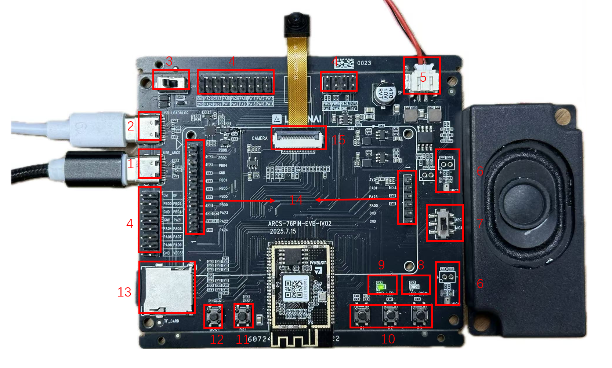

.. _hw_arcs_evb:

ARCS EVB 评估板
===============

概述
----

ARCS EVB 是一款功能丰富的评估板，集成多种外设接口，适用于产品原型开发和功能评估。

- **板型标识**：``arcs_evb``
- **搭载芯片**：:ref:`LS2684L0U <soc_ls26xx>` （16MB PSRAM + NPU）

*ARCS EVB 评估板外观图（标注序号说明见下表）*

接口与组件
----------

.. list-table::
   :header-rows: 1
   :widths: 5 15 40

   * - 序号
     - 接口/组件
     - 说明
   * - 1
     - USB 接口
     - TypeC，供电和充电
   * - 2
     - 烧录接口
     - TypeC，日志输出和固件烧录（需先烧录 boot 固件）
   * - 3
     - 电源开关
     - 控制整板主电源
   * - 4
     - I/O 接口
     - 引出 30 个 IO 和多组电源
   * - 5
     - 扬声器接口
     - 连接配套扬声器，可替换
   * - 6
     - 麦克风接口
     - 连接配套驻极体麦克风，可替换
   * - 7
     - 硬回采开关
     - 支持单麦硬回采 / 双麦软回采切换
   * - 8
     - I/O 电源指示灯
     - 可编程 LED（B09 引脚）
   * - 9
     - 电源 LED
     - 供电状态指示
   * - 10
     - ADC 按键
     - 通过 GPADC 检测电压
   * - 11
     - RST 按键
     - 短按复位
   * - 12
     - BOOT 按键
     - 长按上电进入烧录模式
   * - 13
     - TF 卡槽
     - 插入 TF 存储卡
   * - 14
     - 屏幕连接器
     - 连接配套 LCD，适配板兼容不同 QSPI/SPI 屏幕
   * - 15
     - 摄像头 DVP 接口
     - FPC 连接器，连接配套摄像头

引脚分配
--------

串口（UART）
^^^^^^^^^^^^

.. list-table::
   :header-rows: 1

   * - 串口
     - 引脚
     - 功能
     - 说明
   * - UART0
     - PAD_A[3] / PAD_A[2]
     - TX / RX
     - CP 日志输出
   * - UART1
     - PAD_A[21]
     - TX
     - AP 日志输出

I2C
^^^

.. list-table::
   :header-rows: 1

   * - 总线
     - SCL
     - SDA
     - 说明
   * - I2C0
     - PAD_A[22]
     - PAD_A[23]
     - 摄像头 / 触摸屏复用

SPI
^^^

.. list-table::
   :header-rows: 1

   * - 总线
     - CLK
     - MISO
     - MOSI
     - 说明
   * - SPI1
     - PAD_B[5]
     - PAD_B[3]
     - PAD_B[1]
     - 主 SPI

其他外设
^^^^^^^^

- **SDIO**：PAD_A[4-9]（6 引脚），SD 卡 / eMMC
- **DVP**：PAD_A[10-20, 26]（12 引脚），摄像头接口
- **ADC**：PAD_B[6]，模拟信号采集
- **PWM**：PAD_A[0]，LCD 背光控制
- **LED**：PAD_B[9]

完整引脚功能表
^^^^^^^^^^^^^^

.. seealso::
   - :ref:`板型使用指南 <hw_boards>` — 板型机制、自定义板型开发
   - :ref:`LS26xx 芯片参考 <soc_ls26xx>` — SoC 架构与外设资源
