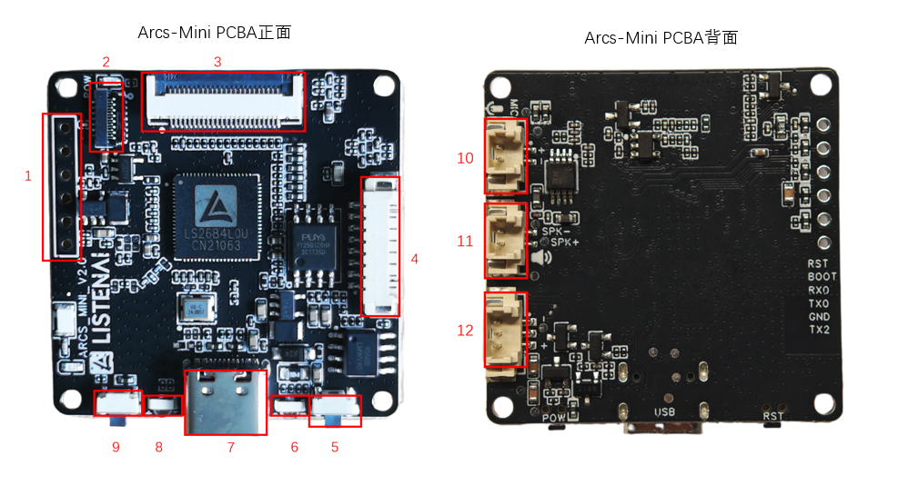

.. _hw_arcs_mini:

ARCS Mini 开发板
================

概述
----

ARCS Mini 是一款紧凑型开发板，适用于快速原型开发和嵌入式应用学习。

- **板型标识**：``arcs_mini``
- **搭载芯片**：:ref:`LS2684L0U <soc_ls26xx>` （16MB PSRAM + NPU）

*ARCS Mini 开发板外观图（标注序号说明见下表）*

接口与组件
----------

.. list-table::
   :header-rows: 1
   :widths: 5 15 40

   * - 序号
     - 接口/组件
     - 说明
   * - 1
     - 预留烧录串口
     - 引出烧录和日志引脚（boot 固件已工厂预烧录）
   * - 2
     - 屏幕 SPI 接口
     - 连接配套 LCD
   * - 3
     - 摄像头 DVP 接口
     - FPC 连接器，连接配套摄像头
   * - 4
     - I/O 扩展接口
     - 引出 6 个 GPIO + 电源/GND（A04-A09）
   * - 5
     - 主功能按键
     - 开关机等交互触发
   * - 6
     - 充放电 LED
     - 充电时红色常亮
   * - 7
     - USB 接口
     - TypeC，供电 / 充电 / 固件烧录
   * - 8
     - 可编程 LED
     - B01 引脚控制
   * - 9
     - RST 按钮
     - 短按复位
   * - 10
     - 麦克风接口
     - 连接配套驻极体麦克风，可替换
   * - 11
     - 扬声器接口
     - 连接配套扬声器，可替换
   * - 12
     - 锂电池接口
     - 连接配套锂电池

引脚分配
--------

串口（UART）
^^^^^^^^^^^^

.. list-table::
   :header-rows: 1

   * - 串口
     - 引脚
     - 功能
     - 说明
   * - UART0
     - PAD_A[3] / PAD_A[2]
     - TX / RX
     - AP 日志输出
   * - UART2
     - PAD_B[2]
     - TX
     - CP 日志输出

I2C
^^^

.. list-table::
   :header-rows: 1

   * - 总线
     - SCL
     - SDA
     - 说明
   * - I2C0
     - PAD_B[7]
     - PAD_B[6]
     - 摄像头

SPI
^^^

.. list-table::
   :header-rows: 1

   * - 总线
     - CS
     - MOSI
     - CLK
     - 说明
   * - SPI0
     - PAD_A[22]
     - PAD_A[24]
     - PAD_A[25]
     - LCD SPI

其他外设
^^^^^^^^

- **SDIO**：PAD_A[4-9]（6 引脚），SD 卡 / eMMC（与 I/O 扩展复用）
- **DVP**：PAD_A[10-20, 26]（12 引脚），摄像头接口
- **ADC**：PAD_B[5]，电池电压检测
- **PWM**：PAD_A[21]，LCD 背光控制
- **LED**：PAD_B[1]

电源管理
^^^^^^^^

Mini 板集成锂电池管理：

- **POWER_EN**：PAD_B[3]，电源使能
- **POWER_KEY**：PAD_B[4]，主功能按键
- **CHARGE_DET**：PAD_B[8]，充电状态检测
- **BAT_ADC**：PAD_B[5]，电池电压 ADC 采集

完整引脚功能表
^^^^^^^^^^^^^^

.. seealso::
   - :ref:`板型使用指南 <hw_boards>` — 板型机制、自定义板型开发
   - :ref:`LS26xx 芯片参考 <soc_ls26xx>` — SoC 架构与外设资源
