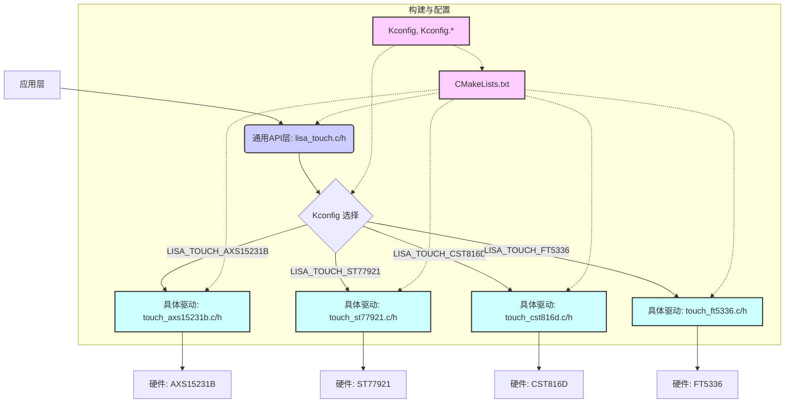
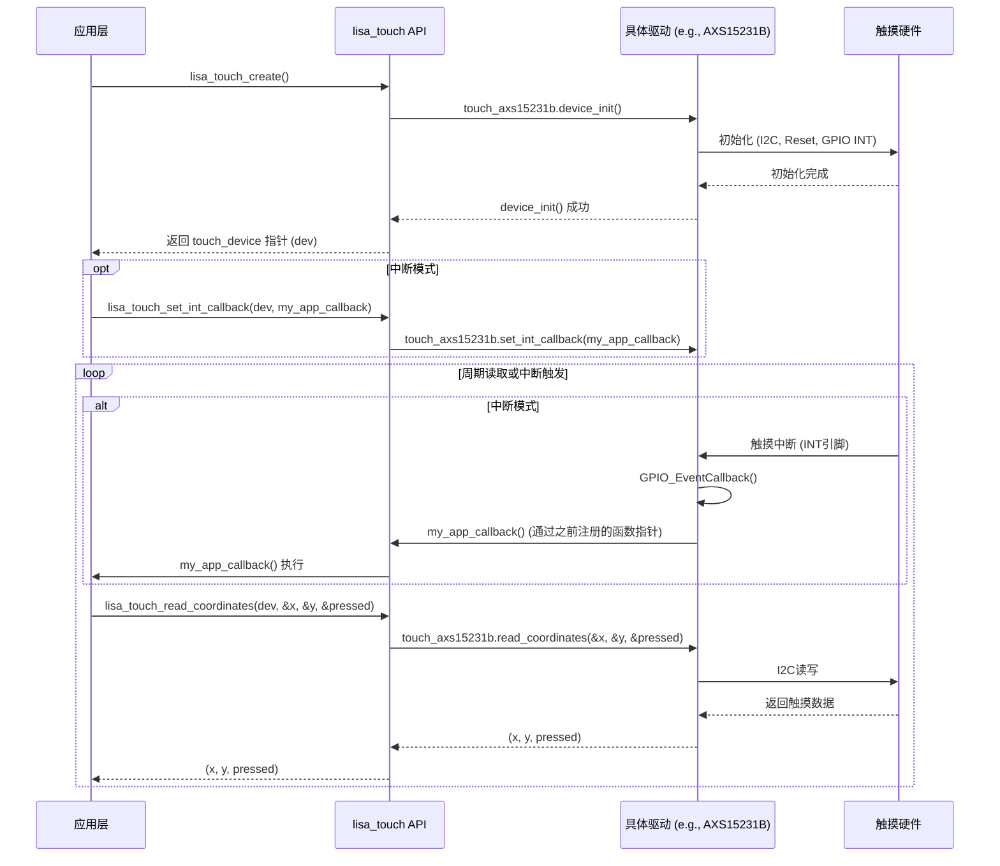

# Touch 模块 (components/touch)

## 1. 概述

Touch 模块为系统提供了触摸屏输入功能。它包含一个通用的触摸设备抽象层以及针对不同触摸控制器芯片的具体驱动实现。该模块允许应用程序以统一的方式与触摸屏硬件交互，获取触摸坐标和状态。

## 2. 架构

Touch 模块采用分层架构设计，主要包括：

*   **通用API层**: 定义了标准的触摸设备接口和数据结构。
*   **具体驱动层**: 实现了针对特定触摸控制器芯片的硬件操作逻辑。
*   **配置层**: 通过 Kconfig 配置文件选择和配置触摸设备。
*   **构建系统**: 根据配置编译相应的文件。



## 3. 核心组件

### 3.1. 通用API层 (`lisa_touch.h`, `lisa_touch.c`)

*   **`lisa_touch.h`**:
    *   定义了核心数据结构：`lisa_touch_callback_t` (中断回调函数指针类型)，`struct touch_driver_api` (驱动API函数表)，`struct touch_device` (触摸设备实例结构)。
    *   声明了供应用层调用的标准接口函数，如 `lisa_touch_create()`, `lisa_touch_read_coordinates()`, `lisa_touch_set_int_callback()` 等。
*   **`lisa_touch.c`**:
    *   实现了 `lisa_touch_create()`，该函数根据 Kconfig 的配置（例如 `CONFIG_LISA_TOUCH_AXS15231B`）来初始化并返回一个具体的 `touch_device` 实例。
    *   实现了标准接口函数，这些函数内部会调用具体驱动的 `touch_driver_api` 中的对应函数。

### 3.2. 具体驱动层 (以 `touch_axs15231b.c/h` 为例)

*   **`touch_axs15231b.h`**:
    *   声明了该驱动的 `struct touch_device` 实例：`extern const struct touch_device touch_axs15231b;`。
*   **`touch_axs15231b.c`**:
    *   实现了 `axs15231b_touch_init()`：初始化触摸芯片硬件（如引脚配置、I2C通信、复位）。
    *   实现了 `axs15231b_read_coordinates()`：通过 I2C 读取触摸点的原始数据并解析出坐标和按压状态。
    *   实现了 `axs15231b_set_int_callback()`：保存上层注册的中断回调。
    *   提供了 `GPIO_EventCallback()`：当触摸中断引脚触发时，调用已注册的上层回调。
    *   定义了 `static const struct touch_driver_api axs15231b_driver_api`，将通用API映射到具体实现。
    *   定义了 `const struct touch_device touch_axs15231b` 实例，填充了设备名、初始化函数和API表。
    *   其他驱动 (e.g., `touch_st77921.c`, `touch_cst816d.c`, `touch_ft5336.c`) 遵循类似的结构，为各自的触摸芯片提供实现。

### 3.3. 配置层 (`Kconfig`, `Kconfig.*`)

*   **`Kconfig`**:
    *   `LISA_TOUCH`: 总开关，用于启用或禁用触摸功能。
    *   `LISA_TOUCH_DEVICE`: `choice` 类型，允许用户选择一个具体的触摸芯片驱动（例如 `LISA_TOUCH_AXS15231B`）。这确保了只有一个驱动被编译和链接。
    *   `LISA_TOUCH_INTERRUPT`: 配置是否启用触摸中断引脚支持。
    *   `LISA_TOUCH_READ_FREQUENCY`: 配置触摸读取频率。
    *   通过 `rsource` 引入特定驱动的 Kconfig 文件 (如 `Kconfig.axs15231b`)。
*   **`Kconfig.<chip_name>`** (例如 `Kconfig.axs15231b`):
    *   可以包含该特定芯片的额外配置选项（当前示例中为空）。

### 3.4. 构建系统 (`CMakeLists.txt`)

*   根据 `CONFIG_LISA_TOUCH` 是否定义来决定是否编译整个模块。
*   `listenai_library_sources(lisa_touch.c)`: 编译通用API层。
*   `listenai_library_sources_ifdef(CONFIG_LISA_TOUCH_CHIPNAME chip_driver.c)`: 根据 Kconfig 选择的具体芯片驱动，条件编译对应的驱动源文件。

## 4. 关键数据结构

*   **`typedef void (*lisa_touch_callback_t)(void);`**
    *   触摸中断回调函数的类型定义。
    *   **注意**: 此回调在中断上下文中执行，应保持简短，避免阻塞操作。

*   **`struct touch_driver_api`**
    *   定义了底层触摸驱动必须实现的一组标准操作函数。
    *   ```c
      struct touch_driver_api {
          int (*read_coordinates)(uint16_t *x, uint16_t *y, bool *pressed);
          void (*set_int_callback)(lisa_touch_callback_t cb);
          int (*set_enable)(bool enable);
          int (*set_inverted_x)(bool inverted);
          int (*set_inverted_y)(bool inverted);
          int (*set_swap_xy)(bool swap);
      };
      ```

*   **`struct touch_device`**
    *   封装了一个触摸设备实例。
    *   ```c
      struct touch_device {
          const char *name;               // 设备名称
          int (*device_init)(void);      // 设备初始化函数
          const struct touch_driver_api *api; // 指向驱动API实现的指针
      };
      ```

## 5. 核心功能

### 5.1. 设备初始化

1.  应用层调用 `lisa_touch_create()`。
2.  `lisa_touch_create()` 根据 Kconfig 选项确定当前活动的触摸设备驱动（例如 `touch_axs15231b`）。
3.  调用所选驱动的 `device_init` 函数（例如 `axs15231b_touch_init()`）。
    *   该函数执行硬件相关的初始化：引脚复用配置、I2C 外设初始化、触摸芯片复位、GPIO 中断引脚配置。
4.  `lisa_touch_create()` 返回初始化后的 `touch_device` 实例指针。

### 5.2. 坐标读取

1.  应用层调用 `lisa_touch_read_coordinates(dev, &x, &y, &pressed)`，传入 `lisa_touch_create()` 返回的设备指针。
2.  `lisa_touch_read_coordinates()` 调用 `dev->api->read_coordinates(&x, &y, &pressed)`。
3.  具体驱动的 `read_coordinates` 函数（例如 `axs15231b_read_coordinates()`）执行以下操作：
    *   通过 I2C 向触摸芯片发送读取命令。
    *   接收芯片返回的数据。
    *   解析数据，提取 X、Y 坐标和按压状态。
    *   进行可能的坐标校准或数据过滤。
    *   将结果通过指针返回。

### 5.3. 中断处理 (如果 `CONFIG_LISA_TOUCH_INTERRUPT` 启用)

1.  应用层或上层模块调用 `lisa_touch_set_int_callback(dev, my_callback_func)` 注册回调。
2.  `lisa_touch_set_int_callback()` 调用 `dev->api->set_int_callback(my_callback_func)`。
3.  具体驱动的 `set_int_callback` 函数（例如 `axs15231b_set_int_callback()`）保存 `my_callback_func`。
4.  当触摸屏产生触摸事件时，触摸芯片的 INT 引脚电平变化，触发 GPIO 中断。
5.  具体驱动中注册的 GPIO 中断服务程序（例如 `GPIO_EventCallback` in `touch_axs15231b.c`）被调用。
6.  `GPIO_EventCallback` 调用之前保存的 `my_callback_func`。

### 5.4. 配置选项

*   **使能/禁用**: `lisa_touch_set_enable(dev, bool enable)`
*   **X轴反转**: `lisa_touch_set_inverted_x(dev, bool inverted)`
*   **Y轴反转**: `lisa_touch_set_inverted_y(dev, bool inverted)`
*   **XY轴交换**: `lisa_touch_set_swap_xy(dev, bool swap)`
    *   这些函数通过通用API层调用具体驱动的对应实现。
    *   **注意**: 并非所有具体驱动都完整实现了这些配置功能（例如 `touch_axs15231b.c` 中的这些函数目前是空实现并打印警告）。

## 6. 配置与构建

### 6.1. Kconfig 主要选项

*   `CONFIG_LISA_TOUCH=y`: 启用触摸模块。
*   `CONFIG_LISA_TOUCH_DEVICE`:
    *   `CONFIG_LISA_TOUCH_AXS15231B=y`: 选择 AXS15231B 触摸芯片。
    *   `CONFIG_LISA_TOUCH_ST77921=y`: 选择 ST77921 触摸芯片。
    *   ... (其他芯片选项)
*   `CONFIG_LISA_TOUCH_INTERRUPT=y`: 启用触摸中断支持。
*   `CONFIG_LISA_TOUCH_READ_FREQUENCY=20`: 设置触摸读取频率 (单位 Hz，若为0则可能表示仅中断驱动或按需读取)。

### 6.2. CMake 构建

*   `components/touch/CMakeLists.txt` 文件负责模块的构建。
*   如果 `CONFIG_LISA_TOUCH` 被定义，则：
    *   编译 `lisa_touch.c`。
    *   根据 `CONFIG_LISA_TOUCH_AXS15231B` 等定义，条件编译对应的 `touch_axs15231b.c` 等文件。
    *   将当前目录 (`.`) 添加到包含路径中。

## 7. 使用流程示例



## 8. 依赖关系

*   **I2C 驱动**: 用于与触摸芯片通信。
*   **GPIO 驱动**: 用于控制 RESET 引脚和接收 INT 引脚中断。
*   **Systick (或等效延时服务)**: 用于初始化时的延时。
*   **`arcs_ap.h`**: 可能包含平台相关的定义或外设访问接口。
*   **`IOMuxManager`**: 用于引脚功能配置。
*   **`log_print.h`**: 日志打印。
*   **FreeRTOS (可选)**: 如果 `CONFIG_LISA_TOUCH_READ_FREQUENCY > 0`，`lisa_touch.c` 中可能会包含使用 FreeRTOS 任务进行周期读取的逻辑（当前分析的 `lisa_touch.c` 代码片段未直接显示，但 Kconfig 暗示）。
*   **Core Spinlock (可选)**: 如果 `CONFIG_CORE_SPINLOCK` 启用，用于保护I2C访问等临界区。

## 9. 注意事项与限制

*   **驱动单选**: 系统在编译时通过 Kconfig 确定一个具体的触摸驱动，不支持运行时切换。
*   **功能完整性**: 某些具体驱动可能未完全实现通用API层定义的所有功能（例如，`touch_axs15231b.c` 中的 `set_enable`, `set_inverted_x/y`, `set_swap_xy` 等函数为空实现）。
*   **中断回调**: 通过 `lisa_touch_set_int_callback` 注册的回调函数在中断上下文中执行，必须非常快速且不能进行任何可能导致阻塞的操作。
*   **坐标系**: 原始坐标通常是触摸屏的物理坐标，可能需要根据显示屏的分辨率和方向进行映射和转换。反转和交换XY轴的功能即服务于此。
*   **错误处理**: 具体驱动的 `read_coordinates` 函数可能会返回错误码或无效数据，上层应用需要进行检查。例如 `axs15231b_read_coordinates` 会在读取到无效点数或特定异常坐标时返回 -1。
*   **特定模组依赖**: 某些触摸模组（如 AXS15231B）可能存在特定的初始化顺序要求。例如，AXS15231B 模组的触摸控制器 (TP) 需要在其对应的 LCD 显示模块被上电并初始化之后才能正常通信和工作。使用此类模组时，务必确保遵循其硬件手册或示例代码中指明的初始化顺序。

