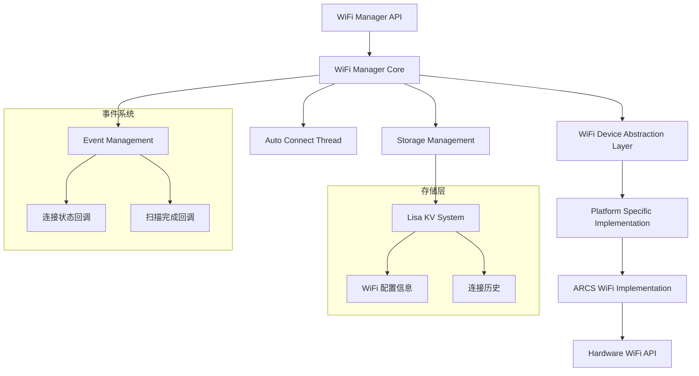
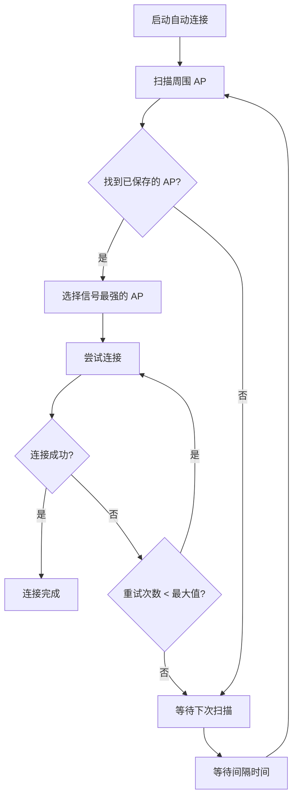

# WiFi Manager 模块详细分析

## 1. 模块概述

WiFi Manager 是 ToyCloud-CP SDK 中的核心网络连接管理模块，位于 `modules/wifi_manager/`。该模块提供了完整的 WiFi 连接管理功能，包括 Station 模式连接、AP 扫描、连接信息存储、自动重连等功能。

### 1.1 主要功能
- **WiFi Station 连接管理**: 支持连接到 WiFi 热点
- **AP 扫描**: 扫描周围可用的 WiFi 热点
- **连接信息存储**: 使用 NVS/KV 存储已连接的 WiFi 信息
- **自动重连**: 支持断线自动重连功能
- **事件回调**: 提供连接状态变化和扫描完成的事件通知
- **多平台支持**: 通过抽象层支持不同的 WiFi 硬件平台

### 1.2 模块架构



## 2. 目录结构

```
modules/wifi_manager/
├── include/
│   ├── wifi_manager/
│   │   ├── wifi_manager.h      # 主要 API 接口
│   │   ├── wifi_dev.h          # 设备抽象层接口
│   │   └── dlist.h             # 双向链表实现
│   └── priv/
│       └── platform_dev.h      # 平台相关私有接口
├── src/
│   └── wifi_manager.c          # 核心实现
├── port/
│   ├── wifi_dev.c              # 设备抽象层实现
│   ├── wifi_arcs.c             # ARCS 平台具体实现
│   └── platform_dev.c         # 平台设备接口
├── test/                       # 测试代码
├── CMakeLists.txt              # 构建配置
├── Kconfig                     # 配置选项
└── Kconfig.nvs                 # NVS 相关配置
```

## 3. 核心数据结构

### 3.1 WiFi 配置结构

```c
typedef struct {
    char ssid[WIFI_DEV_SSID_LEN+1];                 // WiFi SSID (32字节)
    char pwd[WIFI_DEV_PWD_LEN+1];                   // WiFi 密码 (64字节)
    char bssid[WIFI_DEV_BSSID_LEN+1];               // MAC 地址 (17字节)
    uint8_t channel;                                // 信道
    int rssi;                                       // 信号强度
    wifi_dev_encryption_mode_t encryption_mode;     // 加密模式
} wifi_mgr_sta_config_t;
```

### 3.2 连接状态枚举

```c
typedef enum {
    WIFI_MGR_STA_CONNECTED = 0,     // 已连接
    WIFI_MGR_STA_CONNECTING,        // 连接中
    WIFI_MGR_STA_DISCONNECTED,      // 已断开
    WIFI_MGR_STA_MAX = 0xFF
} wifi_mgr_connection_status_t;
```

### 3.3 扫描信息结构

```c
typedef struct {
    char ssid[WIFI_DEV_SSID_LEN+1];                 // AP SSID
    char bssid[WIFI_DEV_BSSID_LEN+1];               // AP BSSID
    int rssi;                                       // 信号强度
    uint8_t channel;                                // 信道
    wifi_dev_encryption_mode_t encryption_mode;     // 加密模式
} wifi_mgr_scan_info_t;
```

## 4. 主要 API 接口

### 4.1 初始化和去初始化

```c
// 初始化 WiFi Manager
int wifi_mgr_init();

// 去初始化 WiFi Manager (已废弃)
int wifi_mgr_deinit();
```

### 4.2 Station 模式管理

```c
// 启用 Station 模式
int wifi_mgr_sta_enable();

// 禁用 Station 模式
int wifi_mgr_sta_disable();

// 连接到指定 WiFi
int wifi_mgr_sta_connect(wifi_mgr_sta_config_t *sta_config, bool asynchronous);

// 断开 WiFi 连接
int wifi_mgr_sta_disconnect(bool asynchronous);

// 获取连接状态
wifi_mgr_connection_status_t wifi_mgr_sta_get_status();

// 获取已连接的 WiFi 信息
int wifi_mgr_sta_get_connected_info(wifi_mgr_sta_config_t *sta_info);
```

### 4.3 AP 扫描功能

```c
// 扫描周围 AP
int wifi_mgr_scan_ap(wifi_mgr_scan_info_t *ap_info, uint32_t size, bool asynchronous);

// 添加扫描完成回调
int wifi_mgr_add_scan_done_cb(wifi_mgr_scan_done_cb_t scandone_cb, void *arg);

// 移除扫描完成回调
int wifi_mgr_remove_scan_done_cb(wifi_mgr_scan_done_cb_t scandone_cb);
```

### 4.4 事件回调管理

```c
// 添加连接状态变化回调
int wifi_mgr_sta_add_connection_cb(wifi_mgr_connection_cb_t connection_cb, void *arg);

// 移除连接状态变化回调
int wifi_mgr_sta_remove_connection_cb(wifi_mgr_connection_cb_t connection_cb);
```

### 4.5 存储管理

```c
// 保存 WiFi 配置到存储
int wifi_mgr_storage_save_ap(wifi_mgr_sta_config_t *ap_info);

// 强制保存 WiFi 配置 (覆盖已存在的)
int wifi_mgr_storage_save_ap_force(wifi_mgr_sta_config_t *ap_info);

// 删除存储的 WiFi 配置
int wifi_mgr_storage_delete_ap(wifi_mgr_sta_config_t *ap_info);

// 搜索存储的 WiFi 配置
int wifi_mgr_storage_search_ap(wifi_mgr_sta_config_t **matched_list, 
                               wifi_mgr_storage_search_mode_t search_modes, 
                               void* target);
```

### 4.6 自动连接功能

```c
// 启动自动连接
int wifi_mgr_auto_connect_start(wifi_mgr_autoconn_config_t *autoconn_config);

// 停止自动连接
int wifi_mgr_auto_connect_stop();
```

## 5. 配置选项 (Kconfig)

### 5.1 主要配置项

| 配置项 | 默认值 | 说明 |
|--------|--------|------|
| `CONFIG_WIFI_MANAGER` | n | 启用 WiFi Manager 模块 |
| `CONFIG_WIFI_MGR_THREAD_STACK` | 4096 | WiFi Manager 线程栈大小 |
| `CONFIG_WIFI_MGR_THREAD_PRIORITY` | 5 | WiFi Manager 线程优先级 |
| `CONFIG_WIFI_DEV_STATION` | y | 启用 Station 模式 |
| `CONFIG_WIFI_DEV_SOFTAP` | n | 启用 SoftAP 模式 |
| `CONFIG_WIFI_DEV_ARCS` | y | 使用 ARCS 平台 WiFi 实现 |

### 5.2 NVS 存储配置

| 配置项 | 默认值 | 说明 |
|--------|--------|------|
| `CONFIG_WIFI_MGR_NVS_PARTITION_OFFSET` | - | NVS 分区偏移 |
| `CONFIG_WIFI_MGR_NVS_PARTITION_SIZE` | - | NVS 分区大小 |
| `CONFIG_WIFI_MGR_NVS_FLASH_SECTOR_SIZE` | - | Flash 扇区大小 |

## 6. 设备抽象层架构

### 6.1 抽象层接口

WiFi Manager 通过设备抽象层支持多种 WiFi 硬件平台：

```c
typedef struct {
    int (*init)(void);
    int (*deinit)(void);
    int (*add_callback)(wifi_dev_event_cb_t *wifi_event_cb);
    int (*remove_callback)(wifi_dev_event_cb_t *wifi_event_cb);
    int (*scan_ap)(wifi_dev_scan_info_t *ap_info, uint32_t size, 
                   wifi_dev_result_t *result, uint32_t timeout_ms);
    int (*sta_connect)(wifi_dev_sta_config_t *sta_config, 
                       wifi_dev_result_t *result, uint32_t timeout_ms);
    int (*sta_disconnect)(wifi_dev_result_t *result, uint32_t timeout_ms);
    int (*sta_get_status)(void);
    int (*ap_start)(const wifi_dev_softap_config_t *ap_config, 
                    wifi_dev_result_t *result, uint32_t timeout_ms);
    int (*ap_stop)(wifi_dev_result_t *result, uint32_t timeout_ms);
} wifi_dev_ops_t;
```

### 6.2 ARCS 平台实现

ARCS 平台的具体实现位于 `port/wifi_arcs.c`，主要功能：

- **事件处理**: 通过 `ls_event` 系统处理 WiFi 事件
- **内存管理**: 使用 `PLATFORM_MEM_*` 系列函数进行内存管理
- **缓存管理**: 处理 DCache 一致性问题
- **超时处理**: 使用 FreeRTOS 事件组实现超时机制

## 7. 存储系统

### 7.1 存储架构

WiFi Manager 使用 Lisa KV 系统存储 WiFi 配置信息：

- **存储键值**:
  - `wifi-info-count`: 存储的 WiFi 配置数量
  - `wifi-list`: WiFi 配置列表数据

### 7.2 存储数据结构

```c
typedef struct wifi_storage_item {
    wifi_mgr_sta_config_t ap_info;  // WiFi 配置信息
    uint8_t enable;                 // 是否启用
} wifi_storage_item_t;
```

### 7.3 搜索模式

支持多种搜索模式的组合：

```c
typedef enum {
    SEARCH_ALL =            BIT(0),  // 搜索所有
    SEARCH_BY_SSID =        BIT(1),  // 按 SSID 搜索
    SEARCH_BY_BSSID =       BIT(2),  // 按 BSSID 搜索
    SEARCH_BY_PWD =         BIT(3),  // 按密码搜索
    SEARCH_BY_CHANNEL =     BIT(4),  // 按信道搜索
    SEARCH_BY_ENCRYPTION =  BIT(5),  // 按加密模式搜索
} wifi_mgr_storage_search_mode_t;
```

## 8. 自动连接机制

### 8.1 自动连接流程



### 8.2 自动连接配置

```c
typedef struct {
    uint32_t interval_ms;  // 重连间隔时间 (毫秒)
} wifi_mgr_autoconn_config_t;
```

### 8.3 自动连接线程

WiFi Manager 创建专门的线程处理自动连接：

- **线程名称**: `wifi_mgr_thread`
- **栈大小**: `CONFIG_WIFI_MGR_THREAD_STACK` (默认 4096)
- **优先级**: `CONFIG_WIFI_MGR_THREAD_PRIORITY` (默认 5)

## 9. 事件系统

### 9.1 支持的事件类型

```c
typedef enum {
    WIFI_DEV_EVT_STA_CONNECTED =            BIT(0),  // Station 已连接
    WIFI_DEV_EVT_STA_DISCONNECTED =         BIT(1),  // Station 已断开
    WIFI_DEV_EVT_STA_CONNECTING =           BIT(7),  // Station 连接中
    WIFI_DEV_EVT_STA_CONNECTION_FAILED =    BIT(8),  // Station 连接失败
    WIFI_DEV_EVT_SCAN_DONE =                BIT(6),  // 扫描完成
    WIFI_DEV_EVT_SCAN_FAILED =              BIT(9),  // 扫描失败
} wifi_dev_event_t;
```

### 9.2 事件回调结构

```c
typedef struct {
    wifi_mgr_connection_status_t status;  // 连接状态
    wifi_mgr_sta_config_t *sta_info;      // Station 信息
    int reason;                           // 错误原因码
} wifi_mgr_connection_info_t;
```

## 10. 使用示例

### 10.1 基本连接示例

```c
#include "wifi_manager/wifi_manager.h"

// 连接状态回调函数
void wifi_connection_callback(wifi_mgr_connection_info_t *info, void *arg) {
    switch (info->status) {
        case WIFI_MGR_STA_CONNECTED:
            printf("WiFi 连接成功: %s\n", info->sta_info->ssid);
            break;
        case WIFI_MGR_STA_DISCONNECTED:
            printf("WiFi 连接断开, 原因: %d\n", info->reason);
            break;
        case WIFI_MGR_STA_CONNECTING:
            printf("WiFi 连接中...\n");
            break;
    }
}

int main() {
    // 初始化 WiFi Manager
    wifi_mgr_init();
    
    // 添加连接状态回调
    wifi_mgr_sta_add_connection_cb(wifi_connection_callback, NULL);
    
    // 配置 WiFi 连接参数
    wifi_mgr_sta_config_t config = {
        .ssid = "MyWiFi",
        .pwd = "MyPassword",
        .encryption_mode = WIFI_DEV_AUTH_WPA2_PSK
    };
    
    // 连接 WiFi (同步模式)
    int ret = wifi_mgr_sta_connect(&config, false);
    if (ret == 0) {
        printf("WiFi 连接请求发送成功\n");
    }
    
    return 0;
}
```

### 10.2 扫描 AP 示例

```c
// 扫描完成回调函数
void scan_done_callback(wifi_mgr_scan_info_t *aps, int ap_num, void *arg) {
    if (ap_num > 0) {
        printf("扫描到 %d 个 AP:\n", ap_num);
        for (int i = 0; i < ap_num; i++) {
            printf("  SSID: %s, RSSI: %d, 信道: %d\n", 
                   aps[i].ssid, aps[i].rssi, aps[i].channel);
        }
    } else {
        printf("扫描失败, 错误码: %d\n", ap_num);
    }
}

void scan_example() {
    // 添加扫描完成回调
    wifi_mgr_add_scan_done_cb(scan_done_callback, NULL);
    
    // 分配扫描结果缓冲区
    wifi_mgr_scan_info_t *scan_results = malloc(sizeof(wifi_mgr_scan_info_t) * 32);
    
    // 开始扫描 (异步模式)
    int ret = wifi_mgr_scan_ap(scan_results, 32, true);
    if (ret >= 0) {
        printf("扫描请求发送成功\n");
    }
}
```

### 10.3 自动连接示例

```c
void auto_connect_example() {
    // 配置自动连接参数
    wifi_mgr_autoconn_config_t auto_config = {
        .interval_ms = 30000  // 30秒重连间隔
    };
    
    // 启动自动连接
    wifi_mgr_auto_connect_start(&auto_config);
    
    printf("自动连接已启动\n");
}
```

## 11. 错误处理

### 11.1 常见错误码

| 错误码 | 含义 | 处理建议 |
|--------|------|----------|
| `-EINVAL` | 参数无效 | 检查传入参数的有效性 |
| `-ENOMEM` | 内存不足 | 释放不必要的内存或增加堆大小 |
| `-EIO` | I/O 错误 | 检查硬件连接和驱动状态 |
| `-ENOENT` | 未找到 | 检查 WiFi 配置是否存在 |
| `-EEXIST` | 已存在 | WiFi 配置已保存，使用强制保存 |
| `-ETIMEDOUT` | 超时 | 增加超时时间或检查网络状况 |

### 11.2 调试建议

1. **启用日志**: 确保 `lisa_log.h` 正常工作
2. **检查配置**: 验证 Kconfig 配置是否正确
3. **内存检查**: 使用内存调试工具检查内存泄漏
4. **事件跟踪**: 监控 WiFi 事件的触发和处理

## 12. 移植指南

### 12.1 新平台移植步骤

1. **实现设备操作接口**: 在 `port/` 目录下创建新的平台实现文件
2. **注册设备**: 调用 `wifi_dev_module_register()` 注册设备
3. **更新配置**: 在 `Kconfig` 中添加新平台选项
4. **更新构建**: 在 `CMakeLists.txt` 中添加新平台的源文件

### 12.2 平台实现要求

- 实现所有 `wifi_dev_ops_t` 中定义的接口
- 正确处理事件回调和超时机制
- 确保内存管理的正确性
- 处理平台特定的缓存一致性问题

## 13. 性能优化建议

### 13.1 内存优化

- 合理设置线程栈大小
- 及时释放扫描结果内存
- 使用内存池减少碎片

### 13.2 连接优化

- 优化自动重连间隔
- 实现智能 AP 选择算法
- 缓存连接参数减少存储访问

### 13.3 功耗优化

- 合理设置扫描间隔
- 实现休眠模式支持
- 优化事件处理机制

---

*本文档基于 ToyCloud-CP SDK 中的 wifi_manager 模块源码分析生成，版本信息以实际代码为准。*