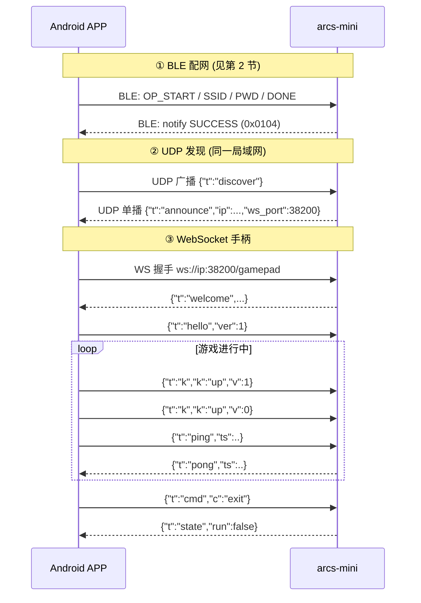

# ARCS Mini 游戏手柄协议规范

版本：v1.0（2026-10-03）
适用：ARCS-MINI 固件 v3.x +，Android 手柄 APP

---

## 1. 概述

ARCS-MINI 设备无物理输入，外部 APP（游戏手柄形态）通过以下三段协议控制设备上的 NES 游戏：

```
Android APP                                ARCS-MINI
    │                                          │
    │ ① BLE 配网 (GATT 0xe402, 已有)            │
    │    下发 SSID/PWD → 设备接入 WiFi           │
    ├─────────────────────────────────────────►│
    │                                          │
    │ ② UDP 发现 (端口 38201, 新增)              │
    │    广播探测 → 单播应答设备 IP/端口           │
    ├─────────────────────────────────────────►│
    │                                          │
    │ ③ WebSocket 手柄 (端口 38200, 新增)        │
    │    ws://<设备IP>:38200/gamepad            │
    │    JSON 按键事件 → NES 手柄位图             │
    ├─────────────────────────────────────────►│
```

- BLE 仅用于配网阶段；游戏阶段走 WiFi（WebSocket）。
- 设备 WiFi 为 STA 模式，手机与设备必须处于**同一局域网**。
- 首版明文 `ws://`、无强制鉴权；预留 `hello.token` 字段。

---

## 2. BLE 配网协议（已有）

> 该协议已在固件中实现（`arcs-sdk/soc/arcs/hal/modules/profiles/netcfg_ble/`、
> `src/middleware/ble/app_ble_common.c`），本节为规范整理；APP 按此实现即可配网。

### 2.1 GATT 定义

| 项 | UUID | 属性 | 说明 |
| --- | --- | --- | --- |
| Netcfg Service | `0xE402` | — | 主服务 |
| Data Buff | `0xE403` | Write + Notify | 数据通道（双向） |
| Client Char Config | 标准 CCCD | Read/Write | 订阅 Notify |
| Stats | `0xE404` | Read | 2 字节状态 |

广播名：`ARCS`。

### 2.2 帧格式

所有写 `0xE403` 的报文为分片格式，每包 ≤20 字节：

```
偏移 0: raw_index   (1B) 分片序号，从 1 开始
偏移 1: raw_count   (1B) 总分片数
偏移 2: raw_length  (1B) 本分片 data 长度
偏移 3: data[raw_length]
```

**第一分片**（raw_index==1）的 data 前 6 字节为命令头：

```
offset 0: prefix_id (2B LE) = 0x03E4
offset 2: opcode    (2B LE)
offset 4: len       (2B LE) 有效数据总长
offset 6: data[raw_length - 6]   首段数据
```

后续分片 data 为纯数据续段。

### 2.3 Opcode

| Opcode | 值 | 方向 | 数据 | 说明 |
| --- | --- | --- | --- | --- |
| OP_START | 0xA001 | APP→设备 | 无 | 开始配网会话 |
| OP_SSID | 0xA002 | APP→设备 | SSID 字符串（≤36B，可分片） | WiFi 名称 |
| OP_PWD | 0xA003 | APP→设备 | 密码字符串（≤64B，可分片） | WiFi 密码 |
| OP_DONE | 0xA010 | APP→设备 | 无 | 触发 WiFi 连接 |
| OP_REBOOT | 0xA011 | APP→设备 | 无 | 重启设备 |
| AUTH_INFO | 0xA012 | APP→设备 | 无 | 查询设备鉴权信息（product_id/device_id） |
| OP_SKIP_WIFI | 0xA013 | APP→设备 | 无 | 跳过 WiFi |

### 2.4 状态通知（设备 → APP，Notify `0xE403`）

固定 **2 字节小端**：

| 状态 | 值 | 说明 |
| --- | --- | --- |
| NETCFG_BLE_READY | 0x0100 | 就绪 |
| NETCFG_BLE_START | 0x0101 | 会话开始 |
| NETCFG_BLE_INPROCESS | 0x0102 | 配网进行中 |
| NETCFG_BLE_CERT_READY | 0x0103 | 凭据收齐 |
| NETCFG_BLE_SUCCESS | 0x0104 | 配网成功（WiFi 连接中/已连） |
| NETCFG_BLE_REBOOTING | 0x0105 | 重启中 |
| NETCFG_BLE_IDLE | 0x0106 | 空闲 |
| NETCFG_BLE_ERR | 0x010A | 失败 |

另有**自定义数据通知**（同一分片格式，用于 AUTH_INFO 应答等）：

```json
{"code":0,"product_id":"...","device_id":"..."}
```

### 2.5 配网时序

```
APP                                设备
 │  扫描广播名 "ARCS"，连接 GATT      │
 │  订阅 0xE403 CCCD                 │
 ├─写 0xE403─OP_START───────────────►│ 状态→INPROCESS，notify 0x0102
 ├─写 0xE403─OP_SSID "MyWiFi"───────►│ notify 0x0107
 ├─写 0xE403─OP_PWD  "pass"─────────►│ notify 0x0108 / CERT_READY
 ├─写 0xE403─OP_DONE────────────────►│ sys_network_connect_wifi()
 │◄─notify 0x0104 (SUCCESS)──────────┤ WiFi 连接中→IP 已获取
 │  （可选）AUTH_INFO───────────────►│ 回 {"code":0,...} 自定义通知
```

### 2.6 （新增，可选）查询设备 IP 与 WS 端口

配网成功后设备获取 DHCP IP。为让 APP 在 BLE 会话内直接拿到连接信息（免 UDP 发现），
新增：

| Opcode | 值 | 方向 | 数据 |
| --- | --- | --- | --- |
| OP_GET_NET_INFO | 0xA015 | APP→设备 | 无 |

> 取 0xA015 是因为 `0xA014` 已被内核枚举占用为 `NETCFG_BLE_OP_MAX`（边界标记）。
> 该 opcode 需在 `netcfg_bles.c` 状态机与 `app_ble_common.c` 中新增处理分支（设备侧改动）。

设备以**自定义数据通知**（分片格式）回：

```json
{"t":"netinfo","ip":"192.168.1.23","ws_port":38200,"disc_port":38201,"fw":"v3.0.2"}
```

> UDP 发现（第 3 节）为主要路径；BLE 查 IP 作为 BLE 会话仍在时的快速路径。

---

## 3. UDP 发现协议（新增）

- 设备监听 **UDP `0.0.0.0:38201`**。
- APP 向子网定向广播（如 `192.168.1.255`）或 `255.255.255.255`:38201 发探测。
- 设备收到探测后向来源地址**单播应答**。
- 报文为 UTF-8 JSON 文本；容错：无法解析的包按 `{"t":"discover"}` 处理（只要长度合法即应答）。
- 设备会**反向记录探测来源 IP**，用于定位 PC 端 ROM 库 HTTP 服务（见 §3.3）。

### 3.1 探测（APP → 设备）

```json
{"t":"discover","ver":1,"client":"android"}
```

| 字段 | 必填 | 说明 |
| --- | --- | --- |
| `t` | 是 | 固定 `discover` |
| `ver` | 否 | 协议版本，当前 `1` |
| `client` | 否 | 客户端身份串，如 `android` / `ubuntu-gui` |
| `http_port` | 否 | **仅 PC 端 GUI**：本机 ROM 查询/下载 HTTP API 端口（见 `doc/pad-http-api.md`） |

> `client` 含 `gui`（大小写不敏感）的探测会被设备视为**桌面端 GUI**；`http_port`
> 让它一次就把 ROM 服务地址交代清楚，无需额外配置。

### 3.2 应答（设备 → APP，单播）

```json
{"t":"announce","ver":1,"dev":"arcs-mini","name":"ARCS",
 "did":"<device_id>","ip":"192.168.1.23","ws_port":38200,"disc_port":38201,
 "udp_port":38202,"fw":"v3.0.2","state":"running"}
```

| 字段 | 说明 |
| --- | --- |
| `did` | 设备唯一 ID（与 BLE AUTH_INFO 的 device_id 一致），多设备区分用 |
| `ip` / `ws_port` | WebSocket 连接目标 |
| `udp_port` | UDP 按键通道端口（§4.6） |
| `state` | `idle`（游戏未运行）/ `running`（游戏运行中） |

可选增强（后续版本）：设备联网后周期（3~5s）广播 `announce`，APP 免探测即可发现。

### 3.3 反向用途：设备确认 PC 端 ROM 服务地址

设备侧要按关键词查 ROM 库时，需要知道「ROM 库服务在哪台机器、哪个端口」。
两条路径，**以主动探测为主**：

**① 设备主动探测（主路径）** —— 不要求 pad_gui 先扫过设备：

```
设备 ──广播 {"t":"discover_server"} ──► 局域网 :38201
      ◄──单播 {"t":"server", "ip":..., "http_port":..., "rom_count":...} ── PC 端 pad_gui
```

```json
// 设备 → 广播
{"t":"discover_server","ver":1,"dev":"arcs-mini","did":"<device_id>"}

// PC 端 → 单播应答
{"t":"server","ver":1,"client":"ubuntu-gui","ip":"192.168.31.205",
 "http_port":38202,"rom_count":1933}
```

| 字段 | 说明 |
| --- | --- |
| `t` | 固定 `server` |
| `http_port` | 本机 ROM 查询/下载 HTTP API 端口（见 `doc/pad-http-api.md`） |
| `rom_count` | 当前扫描到的 ROM 数量（仅提示用） |

> 设备**以应答的源地址为准**（比报文里自报的 `ip` 可信）；`http_port` 缺省按 38202。
> 探测同时走定向广播与本网段受限广播，单次等待约 800ms；结果会缓存，后续
> 调用直接用缓存。pad_gui 未启动 / 不在同网段时才失败。

**② 被动记录（快路径）** —— pad_gui 扫描设备时顺带回传身份，设备直接记下：

| 设备记录 | 来源 | 用途 |
| --- | --- | --- |
| GUI 来源 IP + `http_port` | `client` 含 `gui` 的探测（pad_gui 点「扫描」时，§3.1） | ROM 库 HTTP API 地址 |
| WS 手柄会话对端 IP | WebSocket 连接（§4） | 上面都没有时的兜底 |

**地址优先级**：串口配置 `kv set string user.rom_api_url http://<PC-IP>:<port>`
（显式覆盖，最优先）→ ①/② 得到的地址 → 失败（提示启动 pad_gui 或配置 KV）。

设备侧按关键词查 ROM 库（MCP 工具 `rom_search`）或加载 ROM（`rom_load`）时都走这套
解析。**推荐**：PC 端只要启动 pad_gui 即可 —— 它会同时监听 38201 应答设备的主动探测，
不需要先点「扫描」。`-ip` 直接连接的模式下同样可用（主动探测与 WS 会话无关）。

---

## 4. WebSocket 手柄协议（新增）

- 端点：`ws://<设备IP>:38200/gamepad`
- 子协议：无；报文为 UTF-8 JSON 文本帧。
- 同时仅支持 **1 个手柄连接**；新连接到来时设备断开旧连接。

### 4.1 设备 → APP

**连接建立即发：**

```json
{"t":"welcome","ver":1,"proto":"gamepad","dev":"arcs-mini","fw":"v3.0.2",
 "state":"running","fps":60,"udp_port":38202,"ble":false}
```

`udp_port` 为 UDP 按键通道端口（§4.6）；旧固件不携带该字段，按键走 WS 差分事件。

`ble`：**BLE 直连手柄是否正在接管输入**。为 `true` 时网络侧（WS `k` 事件 / `reset` /
UDP 位图）的按键**一律被忽略**（见 §4.2），客户端应据此提示用户，而不是让用户以为按键失灵。

**心跳应答 / 状态推送 / 错误：**

```json
{"t":"pong","ts":12345}
{"t":"state","run":true,"fps":60,"ble":false}
{"t":"err","code":-1,"msg":"unknown key"}
{"t":"rom_ack","ok":true,"msg":"staged, game restarting"}
```

### 4.2 APP → 设备

```json
{"t":"hello","ver":1,"client":"android","name":"Pixel","token":""}   // 首帧握手
{"t":"k","k":"up","v":1}        // 按键事件: v=1 按下, v=0 抬起
{"t":"k","k":"a","v":0}
{"t":"ping","ts":12345}         // 心跳 (设备回 pong 带 ts)
{"t":"reset"}                   // 清零手柄位图
{"t":"cmd","c":"exit"}          // 请求退出游戏 (回菜单)
{"t":"cmd","c":"reset"}         // 主机复位: 设备重载当前 ROM (游戏回到开头)
```

`hello` 必须为连接后首帧；`token` 首版留空。

**BLE 手柄优先级**：设备同时支持 BLE 直连手柄（§见设备侧 BLE 手柄驱动）。BLE 手柄
**已连接并订阅成功**时，网络侧的输入通路（`k` 按键事件、`reset` 清位图、UDP 全量位图，
含 UDP 静默 500ms 自动松键）**整体让位、被忽略**，`welcome`/`state` 的 `ble` 字段为 `true`。

原因：BLE 手柄是**事件驱动上报**，按住期间不发帧；网络侧一连上就清位图、UDP 静默又会
自动松键，会把 BLE 正按住的键清掉且 BLE 无法写回（表现为"按住却断掉"）。

不受影响、仍然可用：ROM 推送（§4.2.1）、心跳/遥测、以及 `cmd` 类显式操作
（`exit` / `reset`）—— 它们不是手柄按键。断开 BLE 手柄（设备侧 `blepad off` 或手柄断开）
后网络手柄输入立即恢复。

### 4.2.1 ROM 动态加载（PC/APP → 设备推送本地 ROM）

把一个本地 iNES/NES2.0 镜像推到设备上运行（相当于模拟器的 File→Open ROM）。
**发送方只应推送合法来源的 ROM**（自制 / homebrew / 已获授权的镜像）。

```json
{"t":"rom_begin","size":262160,"crc32":1910497505,"name":"nova.nes"}
<二进制 WS 帧 #1>   // 4KB 每帧, 依序拼接
<二进制 WS 帧 #2>
...
{"t":"rom_end"}
{"t":"rom_cancel"}              // 可选: 中止本次传输
```

| 字段 | 说明 |
| --- | --- |
| `size` | 文件总字节数, 16 ≤ size ≤ 1048576（1MB, 与 nes_rom 分区对齐） |
| `crc32` | 标准 CRC-32（zlib `crc32()`）；填 0 跳过校验 |
| `name` | 仅日志用, 设备不校验 |

设备应答（收到 `rom_end` 并校验通过/失败后）：

```json
{"t":"rom_ack","ok":true,"msg":"staged, game restarting"}
{"t":"rom_ack","ok":false,"msg":"crc32 mismatch"}
```

设备侧行为：

1. 校验：字节数 = `size`、文件头 `NES\x1a`、`crc32`（非 0 时）。
2. 校验通过的镜像进入 **staging**，直到设备重启或被下一次推送替换前一直有效；
   游戏屏打开时优先加载 staged ROM，无推送则回退 `nes_rom` flash 分区。
3. **热重启**：游戏运行中收到新 ROM → 自动停止当前游戏并加载新 ROM（屏闪
   `loading...` 后进入新游戏）；游戏已退出（EXIT）时推送同样会唤醒重载。
4. 断线：传输中途断开即丢弃本次传输（已 staged 的旧镜像不受影响）。
5. 重叠推送：`rom_begin` 会先丢弃未完成的旧传输再重新开始。


### 4.3 键名映射表

| 键名 `k` | NES 手柄位 | 说明 |
| --- | --- | --- |
| `up` | bit11 (0x0800) | 十字键上 |
| `down` | bit10 (0x0400) | 十字键下 |
| `left` | bit9 (0x0200) | 十字键左 |
| `right` | bit8 (0x0100) | 十字键右 |
| `a` | bit15 (0x8000) | A |
| `b` | bit14 (0x4000) | B |
| `select` | bit13 (0x2000) | SELECT |
| `start` | bit12 (0x1000) | START |

### 4.4 设备侧行为约定

1. **事件式 + 短按锁存**：收到 `v=1` 将对应位置入「按下集合」；`v=0` 清除。
   按下集合与「锁存集合」并集供 NES 每逻辑帧读取；帧读取后清锁存。
   保证短于一个逻辑帧（16.7ms）的按键至少被消费一次。
2. **断线清零**：WS 断开 → 按下集合与锁存清零（防粘键）。
3. **退出命令**：`{"t":"cmd","c":"exit"}` → 置退出标志，NES 任务退出循环，
   设备回游戏菜单/主页（由 UI 层决定），并向 APP 推 `{"t":"state","run":false}`。
3a. **复位命令**：`{"t":"cmd","c":"reset"}` → NES 主机 Reset 语义，设备停机并
   重载当前 ROM（staged 优先，无则 flash 分区），游戏回到开头；EXIT 后同样可用。
4. **状态推送**：`state` 报文在游戏启停时主动推送（不必周期发送）。
5. **心跳**：APP 建议每 5s 一次 `ping`；设备 30s 未收到任何帧视为断开（清理状态）。

### 4.5.1 UDP 按键通道（可选低延迟路径）

按键输入可走 UDP（端口经 `welcome`/`announce` 的 `udp_port` 字段协商），
WS 保留给 ROM 推送 / 状态 / 心跳 / 命令。帧为 **8 字节二进制，大端**：

```
偏移 0: magic 0xA5
偏移 1: ver   0x01
偏移 2..5: seq  (u32, 客户端单调递增)
偏移 6..7: mask (u16, 全量按键位图, 位定义同 §4.3)
```

**应用层弱网机制**（无重传，靠状态幂等自愈，参数两端对齐、集中可调）：

| 策略 | 端 | 参数/行为 |
| --- | --- | --- |
| 变化即发 | 客户端 | 按键状态一变立即发当前全量位图 |
| 周期重发 | 客户端 | 连接期间 20Hz 重发当前位图（丢包自愈 + 隐式保活） |
| seq 去重 | 设备 | `(int32)(seq - last) <= 0` 的乱序/重复/陈旧包丢弃 |
| 全量覆盖 | 设备 | mask 直接覆盖按下集合（上升沿进短按锁存，语义同 WS） |
| 静默松键 | 设备 | 500ms 无任何帧（且通道曾活跃）→ 清零全部按键，防粘键/防失联卡键 |

WS 与 UDP 按键可并存（最后写入者生效），客户端应只用其中一条。

**丢包率遥测**（设备 → APP，随状态推送周期 ~2s 一次，仅 UDP peer 活跃时）：

```json
{"t":"udp_stat","seq":1234,"rx":1230}
```

| 字段 | 说明 |
| --- | --- |
| `seq` | 当前会话已应用的最大 seq（静默松键后会话重置归零） |
| `rx` | 当前会话按 seq 去重后接受的帧数 |

APP 结合自身发送计数按窗口差分计算丢包率：`loss = 1 - Δrx/Δsent`；
被设备按 seq 丢弃的乱序帧同样计入（对全量位图流而言乱序帧即无效帧）。

### 4.5 时序图



---

## 5. 端口与常量汇总

| 项 | 值 |
| --- | --- |
| WebSocket 端口 | 38200 (TCP) |
| 发现端口 | 38201 (UDP) |
| UDP 按键端口 | 38202 (UDP, welcome/announce 协商下发) |
| WS 路径 | `/gamepad` |
| ROM 推送上限 | 1MB (1048576 字节) |
| ROM 分块建议 | 4KB 二进制帧 |
| 协议版本 | 1 |
| GATT Service | `0xE402` |
| BLE 前缀 | `0x03E4` |
| 心跳建议间隔 | APP 5s |
| 断开判定 | 30s 无帧 |

---

## 6. BLE 直连手柄（设备侧，CodexPad-S10）

除 WiFi 上的 WS/UDP 手柄，设备还能以 **BLE Central** 直连 CodexPad-S10（`src/middleware/gamepad/ble_pad.c`，
开机自启 `CONFIG_GAMEPAD_BLE_AUTOSTART`）。连接后订阅 `0xFFA1`（Notify，8 字节帧
`[u32 按键][LX][LY][RX][RY]`），映射进同一套 NES 手柄位图。

### 6.1 与网络手柄的关系（互斥）

BLE 手柄**已连接并订阅成功**时，网络侧输入通路整体让位：WS `k` 按键事件、`reset` 清位图、
UDP 全量位图（含静默 500ms 自动松键）全部被忽略；`welcome`/`state` 报文里 `ble` 字段为 `true`。
原因：BLE 手柄是**事件驱动上报**（按住期间不发帧），而网络侧一连上就清位图、UDP 静默又会自动松键，
会把 BLE 按住的键清掉且 BLE 无法写回。

不受影响：ROM 推送（§4.2.1）、心跳/遥测、`cmd exit` / `cmd reset`。断开 BLE 后网络输入立即恢复。

### 6.2 L1 / L2：进入与退出语音模式

| 按键 | 动作 |
| --- | --- |
| **L1** | **进入语音模式**（等同设备按键单击唤醒）：先让游戏让出 `audio0`，再发布唤醒事件 |
| **L2** | **退出语音模式**（回到唤醒等待）：打断进行中的会话/播报，会话结束后游戏自动收回 `audio0` |

两键都**只在上升沿触发**（按住不重复），且不参与 NES 按键位图，不影响游戏操作。

### 6.3 audio0 仲裁（游戏 ⇄ 语音助手）

`audio0` 是单实例。**采样率已全机统一为 16kHz**（见 `lisa_player_adapter.h` 的
`APP_AUDIO0_*` 共享契约）：语音链路本来就是 16k（预编译 lisa_player track 内置 16k），
游戏侧把 APU 的 48k 降采样到 16k 后双方共用同一条播放流。

- **只有一个地方配置** `audio0`：`app_audio0_ensure_play()`（16k / mono / 16bit /
  12×256，幂等：已在跑就什么都不做）。所有人（app_player 输出适配、唤醒引擎、NES 端口）
  都只调它，谁都不许改采样率 —— 从根上消除"16k PCM 灌进 48k 流 → 变调"这类问题。
- **DMA 粒度对齐**：`arcs_audio_play_write()` 会为每个不足一个 DMA buffer 的写入补静音，
  所以写入样本数必须是 `APP_AUDIO0_DMA_SAMPLES`(256) 的整数倍。游戏每帧 266 样本，
  先在端口内累积再写（260→512），否则每帧会掺 ~246 样本静音（声音断续）。
- **让出 = 静音，不停流**：唤醒词路径（`app_wakeup.c`）与手柄 L1（`ble_pad.c`）都会先调
  `voice_audio_owner_yield()`；游戏侧收到后只是**停止喂数据**（并置 `g_audio_dev = NULL`
  让模拟器切到时间兜底节拍，因为正常 60fps 节拍来自音频环的 DMA 背压）。
  底层 DMA 队列空时会自动用静音 buffer 补位，所以不写就是静音 —— 不必 `play_stop`，
  也就不会波及语音侧（历史故障：提示音写进已停的流 → 渲染线程永久阻塞 → 播放器卡在
  PLAYING → TTS 被焦点策略取消 → 整条语音回放全哑）。
- **收回**：NES 音频任务轮询 `voice_audio_in_use()`（会话进行中 / 提示音 / TTS 任一在播），
  全空闲后重新"确保在跑"并重持 PA（无需重配采样率）；带 1.5s 宽限期与 90s 强制收回兜底。

