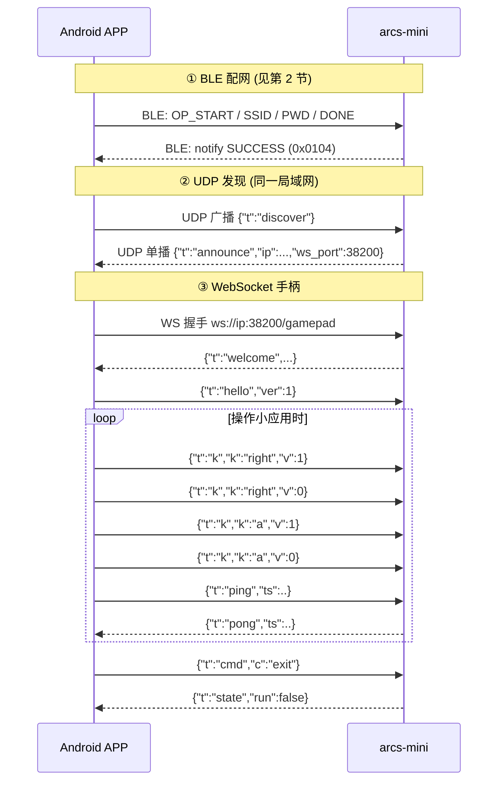

# ARCS Mini 游戏手柄协议规范

版本：v1.0（2026-10-03，2026-10-07 适配小应用运行时）
适用：ARCS-MINI 固件 v3.x +，Android 手柄 APP / PC 端自研客户端

---

## 1. 概述

ARCS-MINI 设备把外部手柄的按键转成**小应用按键事件**（`miniapp_button_click`），
由设备上运行的 Lua 小应用（`tests/miniapp/20-desktop.lua` 那套"桌面"）消费。

按键有三条来源，**都汇到同一条输入层**（`src/middleware/gamepad/gamepad_input.c`）：

| 来源 | 链路 | 适用 |
| --- | --- | --- |
| **BLE 直连**（主路径） | 设备以 Central 角色直连 CodexPad-S10，订阅 `0xFFA1` | 有实体手柄时；开机自启，无需手机/PC |
| WiFi WebSocket / UDP | 设备接入 WiFi，手机 APP / PC 端客户端发包 | 无实体手柄时的调试与替代输入 |
| 设备功能键 | `apps/arcs-mini/button/app_button.c` | 始终可用，只有单击/双击两种事件 |

BLE 直连与网络手柄**互斥**：BLE 手柄连接并订阅成功后，网络侧输入整体让位（见 §6.1）。

网络侧（②）的三段协议：

```
Android APP / PC 客户端                       ARCS-MINI
    │                                          │
    │ ① BLE 配网 (GATT 0xe402, 已有)            │
    │    下发 SSID/PWD → 设备接入 WiFi           │
    ├─────────────────────────────────────────►│
    │                                          │
    │ ② UDP 发现 (端口 38201)                    │
    │    广播探测 → 单播应答设备 IP/端口           │
    ├─────────────────────────────────────────►│
    │                                          │
    │ ③ WebSocket 手柄 (端口 38200)              │
    │    ws://<设备IP>:38200/gamepad            │
    │    JSON 按键事件 → 小应用按键事件            │
    ├─────────────────────────────────────────►│
```

- BLE 仅用于配网阶段；网络手柄走 WiFi（WebSocket / UDP）。
- 设备 WiFi 为 STA 模式，客户端与设备必须处于**同一局域网**。
- 明文 `ws://`、无强制鉴权；预留 `hello.token` 字段。
- 本固件**不实现** ROM 推送（原 NES 分支的 `rom_begin`/`rom_end`）：设备侧无
  游戏 ROM 概念，收到的未知报文类型只记一条告警。

---

## 2. BLE 配网协议（已有）

> 该协议已在固件中实现（`arcs-sdk/soc/arcs/hal/modules/profiles/netcfg_ble/`、
> `src/middleware/ble/app_ble_common.c`），本节为规范整理；APP 按此实现即可配网。

### 2.1 GATT 定义

| 项 | UUID | 属性 | 说明 |
| --- | --- | --- | --- |
| Netcfg Service | `0xE402` | — | 主服务 |
| Data Buff | `0xE403` | Write + Notify | 数据通道（双向） |
| Client Char Config | 标准 CCCD | Read/Write | 订阅 Notify |
| Stats | `0xE404` | Read | 2 字节状态 |

广播名：`ARCS`。

### 2.2 帧格式

所有写 `0xE403` 的报文为分片格式，每包 ≤20 字节：

```
偏移 0: raw_index   (1B) 分片序号，从 1 开始
偏移 1: raw_count   (1B) 总分片数
偏移 2: raw_length  (1B) 本分片 data 长度
偏移 3: data[raw_length]
```

**第一分片**（raw_index==1）的 data 前 6 字节为命令头：

```
offset 0: prefix_id (2B LE) = 0x03E4
offset 2: opcode    (2B LE)
offset 4: len       (2B LE) 有效数据总长
offset 6: data[raw_length - 6]   首段数据
```

后续分片 data 为纯数据续段。

### 2.3 Opcode

| Opcode | 值 | 方向 | 数据 | 说明 |
| --- | --- | --- | --- | --- |
| OP_START | 0xA001 | APP→设备 | 无 | 开始配网会话 |
| OP_SSID | 0xA002 | APP→设备 | SSID 字符串（≤36B，可分片） | WiFi 名称 |
| OP_PWD | 0xA003 | APP→设备 | 密码字符串（≤64B，可分片） | WiFi 密码 |
| OP_DONE | 0xA010 | APP→设备 | 无 | 触发 WiFi 连接 |
| OP_REBOOT | 0xA011 | APP→设备 | 无 | 重启设备 |
| AUTH_INFO | 0xA012 | APP→设备 | 无 | 查询设备鉴权信息（product_id/device_id） |
| OP_SKIP_WIFI | 0xA013 | APP→设备 | 无 | 跳过 WiFi |

### 2.4 状态通知（设备 → APP，Notify `0xE403`）

固定 **2 字节小端**：

| 状态 | 值 | 说明 |
| --- | --- | --- |
| NETCFG_BLE_READY | 0x0100 | 就绪 |
| NETCFG_BLE_START | 0x0101 | 会话开始 |
| NETCFG_BLE_INPROCESS | 0x0102 | 配网进行中 |
| NETCFG_BLE_CERT_READY | 0x0103 | 凭据收齐 |
| NETCFG_BLE_SUCCESS | 0x0104 | 配网成功（WiFi 连接中/已连） |
| NETCFG_BLE_REBOOTING | 0x0105 | 重启中 |
| NETCFG_BLE_IDLE | 0x0106 | 空闲 |
| NETCFG_BLE_ERR | 0x010A | 失败 |

另有**自定义数据通知**（同一分片格式，用于 AUTH_INFO 应答等）：

```json
{"code":0,"product_id":"...","device_id":"..."}
```

### 2.5 配网时序

```
APP                                设备
 │  扫描广播名 "ARCS"，连接 GATT      │
 │  订阅 0xE403 CCCD                 │
 ├─写 0xE403─OP_START───────────────►│ 状态→INPROCESS，notify 0x0102
 ├─写 0xE403─OP_SSID "MyWiFi"───────►│ notify 0x0107
 ├─写 0xE403─OP_PWD  "pass"─────────►│ notify 0x0108 / CERT_READY
 ├─写 0xE403─OP_DONE────────────────►│ sys_network_connect_wifi()
 │◄─notify 0x0104 (SUCCESS)──────────┤ WiFi 连接中→IP 已获取
 │  （可选）AUTH_INFO───────────────►│ 回 {"code":0,...} 自定义通知
```

### 2.6 （新增，可选）查询设备 IP 与 WS 端口

配网成功后设备获取 DHCP IP。为让 APP 在 BLE 会话内直接拿到连接信息（免 UDP 发现），
新增：

| Opcode | 值 | 方向 | 数据 |
| --- | --- | --- | --- |
| OP_GET_NET_INFO | 0xA015 | APP→设备 | 无 |

> 取 0xA015 是因为 `0xA014` 已被内核枚举占用为 `NETCFG_BLE_OP_MAX`（边界标记）。
> 该 opcode 需在 `netcfg_bles.c` 状态机与 `app_ble_common.c` 中新增处理分支（设备侧改动）。

设备以**自定义数据通知**（分片格式）回：

```json
{"t":"netinfo","ip":"192.168.1.23","ws_port":38200,"disc_port":38201,"fw":"v3.0.2"}
```

> UDP 发现（第 3 节）为主要路径；BLE 查 IP 作为 BLE 会话仍在时的快速路径。

---

## 3. UDP 发现协议（新增）

- 设备监听 **UDP `0.0.0.0:38201`**。
- APP 向子网定向广播（如 `192.168.1.255`）或 `255.255.255.255`:38201 发探测。
- 设备收到探测后向来源地址**单播应答**。
- 报文为 UTF-8 JSON 文本；容错：无法解析的包按 `{"t":"discover"}` 处理（只要长度合法即应答）。
- 设备会**反向记录探测来源 IP**，仅用于诊断（见 §3.3）。

### 3.1 探测（APP → 设备）

```json
{"t":"discover","ver":1,"client":"android"}
```

| 字段 | 必填 | 说明 |
| --- | --- | --- |
| `t` | 是 | 固定 `discover` |
| `ver` | 否 | 协议版本，当前 `1` |
| `client` | 否 | 客户端身份串，如 `android` / `ubuntu-gui`（本固件只记日志） |

### 3.2 应答（设备 → APP，单播）

```json
{"t":"announce","ver":1,"dev":"arcs-mini","name":"ARCS",
 "did":"<device_id>","ip":"192.168.1.23","ws_port":38200,"disc_port":38201,
 "udp_port":38202,"fw":"v3.0.2","state":"running"}
```

| 字段 | 说明 |
| --- | --- |
| `did` | 设备唯一 ID（与 BLE AUTH_INFO 的 device_id 一致），多设备区分用 |
| `ip` / `ws_port` | WebSocket 连接目标 |
| `udp_port` | UDP 按键通道端口（§4.5.1） |
| `state` | `idle`（小应用未运行）/ `running`（小应用运行中） |

可选增强（后续版本）：设备联网后周期（3~5s）广播 `announce`，APP 免探测即可发现。

### 3.3 反向记录探测来源（快路径）

设备会把"最近一次探测的来源 IP"记下来（`gamepad_disc_peer_ip()`），纯粹用于诊断：
它能回答"谁能在这个端口看到设备"，也就是设备与客户端确实同网段。

本固件不做「设备主动找 PC 端服务」的反向发现（原 NES 分支用于定位 ROM 库 HTTP
服务的 `{"t":"discover_server"}` / `{"t":"server"}` 一问一答、以及探测里自报的
`http_port` 字段），因为小应用运行时没有需要设备反查的外部服务。
探测报文里带 `client` / `http_port` 等字段不会报错，只是被忽略。

---

## 4. WebSocket 手柄协议（新增）

- 端点：`ws://<设备IP>:38200/gamepad`
- 子协议：无；报文为 UTF-8 JSON 文本帧。
- 同时仅支持 **1 个手柄连接**；新连接到来时设备断开旧连接。

### 4.1 设备 → APP

**连接建立即发：**

```json
{"t":"welcome","ver":1,"proto":"gamepad","dev":"arcs-mini","fw":"v3.0.2",
 "state":"running","fps":50,"udp_port":38202,"ble":false}
```

`udp_port` 为 UDP 按键通道端口（§4.5.1）。

`ble`：**BLE 直连手柄是否正在接管输入**。为 `true` 时网络侧（WS `k` 事件 / `reset` /
UDP 位图）的按键**一律被忽略**（见 §4.2），客户端应据此提示用户，而不是让用户以为按键失灵。

**心跳应答 / 状态推送 / 错误：**

```json
{"t":"pong","ts":12345}
{"t":"state","run":true,"fps":50,"ble":false}
{"t":"err","code":-1,"msg":"unknown key"}
```

### 4.2 APP → 设备

```json
{"t":"hello","ver":1,"client":"android","name":"Pixel","token":""}   // 首帧握手
{"t":"k","k":"up","v":1}        // 按键事件: v=1 按下, v=0 抬起
{"t":"k","k":"a","v":0}
{"t":"ping","ts":12345}         // 心跳 (设备回 pong 带 ts)
{"t":"reset"}                   // 松开全部按键 (不改小应用状态)
{"t":"cmd","c":"exit"}          // 请求退出小应用 (回原生 Home)
{"t":"cmd","c":"reset"}         // 回小应用首页 (等价按"返回")
```

`hello` 必须为连接后首帧；`token` 首版留空。

**BLE 手柄优先级**：设备同时支持 BLE 直连手柄（§6）。BLE 手柄
**已连接并订阅成功**时，网络侧的输入通路（`k` 按键事件、`reset` 松键、UDP 全量位图，
含 UDP 静默 500ms 自动松键）**整体让位、被忽略**，`welcome`/`state` 的 `ble` 字段为 `true`。

原因：BLE 手柄是**事件驱动上报**，按住期间不发帧；网络侧一连上就松键、UDP 静默又会
自动松键，会把 BLE 正按住的键松开且 BLE 无法写回（表现为"按住却断掉"）。

不受影响、仍然可用：心跳/遥测、以及 `cmd` 类显式操作（`exit` / `reset`）—— 它们不是手柄按键。
断开 BLE 手柄（设备侧 `blepad off` 或手柄断开）后网络手柄输入立即恢复。

### 4.3 键名映射表（协议键名 → 线上位图 → 小应用按键）

线上位图定义在 `src/middleware/gamepad/gamepad_proto.h`（沿用旧布局，客户端已实现的
位序不能改）。设备收到后由 `gamepad_input.c` 翻译成小应用按键事件
（`button_id` 取值见 `docs/miniapp.md`）。

| 键名 `k` | 线上位 | 小应用 `button_id` | 桌面上表现为 |
| --- | --- | --- | --- |
| `up` | bit11 (0x0800) | `up` | 焦点上移 / 上一项 |
| `down` | bit10 (0x0400) | `down` | 焦点下移 / 下一项 |
| `left` | bit9 (0x0200) | `left` | 焦点左移 / 上一项 |
| `right` | bit8 (0x0100) | `right` | 焦点右移 / 下一项 |
| `a` | bit15 (0x8000) | `function_double` | 确认（进入应用 / 执行当前命令） |
| `b` | bit14 (0x4000) | `back` | 返回桌面 |
| `start` | bit12 (0x1000) | `function_double` | 同 `a`（确认） |
| `select` | bit13 (0x2000) | `settings` | 直接跳到"设置"应用 |

**方向键的自动重复**：按住方向键时，设备在按下瞬间发一次事件，之后每
`GAMEPAD_REPEAT_PERIOD_MS`(180ms) 重复一次（首次延迟 `GAMEPAD_REPEAT_DELAY_MS` 420ms），
即键盘的自动重复语义 —— 客户端只需在按下/抬起各发一次 `k` 事件，不必自己发连击。
确认键（`a`/`start`）**不做**自动重复，且**按下即发**：不需要连按两下。

> **物理按键名与协议键名不是一回事**（仅 BLE 直连手柄）：CodexPad 的
> **圆/Circle** 映射到协议键 `b`（返回），**叉/Cross** 映射到协议键 `a`（确认）——
> 见 `ble_pad.c` 的 `cpad_buttons_to_mask()`。
> 手柄上还有个 SELECT 键 → `settings`；START 与 `a` 同义。

### 4.4 设备侧行为约定

1. **事件式**：收到 `v=1` 即视为一次"按下"边沿 → 翻译成一次按键事件；`v=0` 只用于
   更新按下集合（方向键的自动重复据此在松手时停止）。用户单击=一次事件、双击=两次
   事件，由小应用侧自行区分（`function` 与设备功能键的 `function_double` 语义不同，
   手柄的 A 直接就是"确认"）。
2. **断线松键**：WS 断开 → 松开全部按键（防粘键、并停掉方向键重复）。
3. **退出命令**：`{"t":"cmd","c":"exit"}` → 关闭小应用并回原生 Home，
   同时向 APP 推 `{"t":"state","run":false}`。
3a. **复位命令**：`{"t":"cmd","c":"reset"}` → 小应用没有"主机复位"语义，
   这里映射成"回小应用首页"（等价按一次 `b`），卡在某个应用里时也能脱身。
4. **状态推送**：`state` 报文在小应用启停时主动推送（不必周期发送）。
5. **心跳**：APP 建议每 5s 一次 `ping`；设备 30s 未收到任何帧视为断开（清理状态）。

### 4.5.1 UDP 按键通道（可选低延迟路径）

按键输入可走 UDP（端口经 `welcome`/`announce` 的 `udp_port` 字段协商），
WS 保留给状态 / 心跳 / 命令。帧为 **8 字节二进制，大端**：

```
偏移 0: magic 0xA5
偏移 1: ver   0x01
偏移 2..5: seq  (u32, 客户端单调递增)
偏移 6..7: mask (u16, 全量按键位图, 位定义同 §4.3)
```

**应用层弱网机制**（无重传，靠状态幂等自愈，参数两端对齐、集中可调）：

| 策略 | 端 | 参数/行为 |
| --- | --- | --- |
| 变化即发 | 客户端 | 按键状态一变立即发当前全量位图 |
| 周期重发 | 客户端 | 连接期间 20Hz 重发当前位图（丢包自愈 + 隐式保活） |
| seq 去重 | 设备 | `(int32)(seq - last) <= 0` 的乱序/重复/陈旧包丢弃 |
| 全量覆盖 | 设备 | mask 直接覆盖按下集合（上升沿进短按锁存，语义同 WS） |
| 静默松键 | 设备 | 500ms 无任何帧（且通道曾活跃）→ 清零全部按键，防粘键/防失联卡键 |

WS 与 UDP 按键可并存（最后写入者生效），客户端应只用其中一条。

**丢包率遥测**（设备 → APP，随状态推送周期 ~2s 一次，仅 UDP peer 活跃时）：

```json
{"t":"udp_stat","seq":1234,"rx":1230}
```

| 字段 | 说明 |
| --- | --- |
| `seq` | 当前会话已应用的最大 seq（静默松键后会话重置归零） |
| `rx` | 当前会话按 seq 去重后接受的帧数 |

APP 结合自身发送计数按窗口差分计算丢包率：`loss = 1 - Δrx/Δsent`；
被设备按 seq 丢弃的乱序帧同样计入（对全量位图流而言乱序帧即无效帧）。

### 4.5 时序图



---

## 5. 端口与常量汇总

| 项 | 值 |
| --- | --- |
| WebSocket 端口 | 38200 (TCP) |
| 发现端口 | 38201 (UDP) |
| UDP 按键端口 | 38202 (UDP, welcome/announce 协商下发) |
| WS 路径 | `/gamepad`（首版不校验路径，任意路径均接受） |
| 协议版本 | 1 |
| GATT Service | `0xE402` |
| BLE 前缀 | `0x03E4` |
| 心跳建议间隔 | APP 5s |
| 断开判定 | 30s 无帧 |
| 方向键自动重复 | 首延迟 420ms，之后 180ms 一次 |

---

## 6. BLE 直连手柄（设备侧，CodexPad-S10）

除 WiFi 上的 WS/UDP 手柄，设备还能以 **BLE Central** 直连 CodexPad-S10（`src/middleware/gamepad/ble_pad.c`，
开机自启 `CONFIG_GAMEPAD_BLE_AUTOSTART`）。连接后订阅 `0xFFA1`（Notify，8 字节帧
`[u32 按键][LX][LY][RX][RY]`），映射进同一张线上位图（§4.3），再翻译成小应用按键事件。

需要 SDK 侧的 GATT 客户端支持（`arcs-sdk/components/lisa_bluetooth/lisa_ble_client*.c`，
以及 `bt_ble_user.c` 里向它转发 GAP 事件的 4 处钩子）。旧 `libstack.a` 本身已支持
Central，**无需升级蓝牙栈**。

### 6.1 与网络手柄的关系（互斥）

BLE 手柄**已连接并订阅成功**时，网络侧输入通路整体让位：WS `k` 按键事件、`reset` 松键、
UDP 全量位图（含静默 500ms 自动松键）全部被忽略；`welcome`/`state` 报文里 `ble` 字段为 `true`。
原因：BLE 手柄是**事件驱动上报**（按住期间不发帧），而网络侧一连上就松键、UDP 静默又会自动松键，
会把 BLE 按住的键松开且 BLE 无法写回。

不受影响：心跳/遥测、`cmd exit` / `cmd reset`。断开 BLE 后网络输入立即恢复。

### 6.2 L1 / L2：进入与退出语音模式

| 按键 | 动作 |
| --- | --- |
| **L1** | **进入语音模式**（等同设备按键单击唤醒）：发布唤醒词事件 |
| **L2** | **退出语音模式**（回到唤醒等待）：打断进行中的会话/播报 |

两键都**只在上升沿触发**（按住不重复），且不参与线上位图、不影响小应用按键。

### 6.3 audio0（本分支无独占者）

L1 唤醒语音助手时会中断设备上的小应用（小应用运行时的 tick 与按键在语音会话期间
暂停，见 `docs/miniapp.md`），并重新发布唤醒词。小应用的蜂鸣走 `app_player`
（`miniapp_player`），与语音链路共用同一条共享 16kHz 播放流，音量与焦点由播放器层
统一仲裁 —— 因此本分支**不需要**显式让出 `audio0`（原 NES 分支的游戏侧有独立的
48k 音频环，才有 `voice_audio_owner_yield()` 这套仲裁）。
