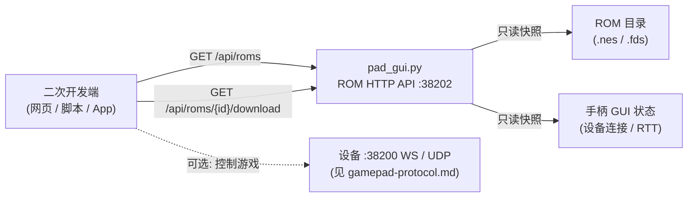

# ARCS 手柄 ROM HTTP API 二次开发文档

版本：v1.0（2026-10-06）
适用：`tools/pad_gui.py`（Ubuntu 桌面端手柄 GUI）
配套：`doc/gamepad-protocol.md`（设备侧 WS/UDP 手柄协议）

---

## 1. 概述

`pad_gui.py` 启动时会**自动在后台拉起一个只读 HTTP 服务**，对外暴露 ROM 库的
查询与下载能力。第三方程序（网页、脚本、移动 App）无需依赖 Qt / GUI，直接用
HTTP 就能：

- 查询 ROM 库中每个文件的**文件信息**（名称、路径、大小、扩展名、iNES 头元数据）；
- 拿到每个 ROM 对应的**可直接下载的 HTTP 地址**，拉取原始字节。
- 顺带查询当前手柄 GUI 与设备的**连接快照**。

服务的特点：

- **只读**：全部接口都是 `GET`，幂等，不会修改任何文件或设备状态；
- **零依赖接入**：标准 HTTP + JSON，浏览器 `fetch` 可直接调用（已开 CORS）；
- **与 GUI 同源**：返回的 ROM 列表就是 GUI 当前扫描到的目录内容，切换目录后自动跟随；
- **仅限局域网**：默认监听 `0.0.0.0`，**无鉴权**，设计用途是同一局域网内的可信环境。



> ROM HTTP API 只负责「查 + 下」；如果想进一步控制游戏（按键 / 推 ROM / 复位），
> 那是设备侧的 WebSocket/UDP 协议，见 `doc/gamepad-protocol.md`。

---

## 2. 启动与地址

**无需额外配置**：只要启动 GUI，HTTP 服务就起来了。

```bash
python3 tools/pad_gui.py [设备IP] [ROM目录]
```

启动后，服务地址会显示在 GUI **左侧 ROM 卡片底部**（可鼠标选中复制）：

```
HTTP API: http://192.168.31.205:38202/
```

### 2.1 环境变量

| 变量 | 默认值 | 说明 |
| --- | --- | --- |
| `PAD_HTTP_PORT` | `38202` | HTTP API 监听端口 |
| `PAD_HTTP_BIND` | `0.0.0.0` | 监听地址；改为 `127.0.0.1` 可只允许本机访问 |

```bash
PAD_HTTP_PORT=8080 PAD_HTTP_BIND=127.0.0.1 python3 tools/pad_gui.py 192.168.31.205
```

端口被占用等启动失败时，GUI 会在同一位置用红色提示 `HTTP API 未启动 (...): ...`，
不影响手柄功能。

### 2.2 端口分配总览

| 端口 | 协议 | 用途 |
| --- | --- | --- |
| `38200` | WebSocket (`/gamepad`) | 设备侧手柄控制 / ROM 推送 / 心跳（设备提供） |
| `38201` | UDP | 设备发现广播（设备提供）+ **本机应答设备的服务端探测** |
| `38202` | HTTP | **本机 ROM 查询/下载 API（本文档）** |

### 2.3 服务端发现（设备如何找到本机）

GUI 启动时会**同时监听 UDP 38201**，应答设备主动发来的探测：

```
设备 ──广播 {"t":"discover_server"} ──► :38201
      ◄──单播 {"t":"server","ip":...,"http_port":38202,"rom_count":...} ── 本机
```

设备据此拿到本机 ROM API 的地址与端口（**不需要**先由 GUI 扫描设备）。
报文格式见 `doc/gamepad-protocol.md` §3.3。

> 端口被占用导致监听失败时不影响 HTTP API 与手柄功能，只是设备需要依靠
> 反向发现（GUI 点「扫描」）或手工配置地址。

---

## 3. 通用约定

- **方法**：仅 `GET`（另支持 `HEAD` 取头部、`OPTIONS` 预检）。
- **编码**：响应体均为 UTF-8；JSON 接口 `Content-Type: application/json; charset=utf-8`。
- **CORS**：所有响应带 `Access-Control-Allow-Origin: *`，浏览器跨域可直接调用。
- **JSON 排版**：`indent=2`、`ensure_ascii=False`（中文不转义，便于人读）。
- **分页/过滤**：见 `/api/roms` 的 query 参数。
- **ROM 标识 `id`**：即**相对于 ROM 根目录的路径**，形如 `0004/五子棋 (J) [!].nes`。
  作为 URL 路径使用时请对 `id` 做 URL 编码（Python `urllib.parse.quote`、JS
  `encodeURIComponent`）；服务端无论收到编码与否都能正确解析。

---

## 4. 数据模型

### 4.1 ROM 对象（`/api/roms` 列表元素、`/api/roms/{id}` 详情）

| 字段 | 类型 | 说明 |
| --- | --- | --- |
| `id` | string | ROM 标识 = 相对路径，如 `0004/五子棋 (J) [!].nes` |
| `name` | string | 文件名（不含目录） |
| `dir` | string | 所在子目录（相对根目录），根目录下为空串 |
| `rel_path` | string | 同 `id`（显式命名，便于阅读） |
| `ext` | string | 扩展名小写，如 `nes` / `fds` |
| `size_bytes` | int | 文件字节数 |
| `size_kb` | int | 文件大小（KB，向下取整） |
| `mtime` | int | 修改时间（Unix 秒） |
| `url` | string | 该 ROM 详情接口的**绝对地址** |
| `download_url` | string | 该 ROM **下载接口的绝对地址** |
| `ines` | object \| null | iNES 头解析结果；非 `.nes` 或无有效头时为 `null`（可用 `with_ines=0` 关闭） |

> `url` / `download_url` 用请求的 `Host` 头拼绝对地址：用哪个 IP 请求，返回的就是那个
> IP 开头的地址，客户端可直接复制使用，无需自己拼。

### 4.2 iNES 元数据对象（`ines` 字段）

| 字段 | 类型 | 说明 |
| --- | --- | --- |
| `format` | string | `iNES` 或 `NES2.0` |
| `mapper` | int | Mapper 编号 |
| `prg_kb` | int | PRG ROM 大小（KB） |
| `chr_kb` | int | CHR ROM 大小（KB），`0` 表示使用 CHR-RAM |
| `chr_ram` | bool | 是否 CHR-RAM（等价 `chr_kb == 0`） |
| `mirroring` | string | `horizontal` / `vertical` |
| `battery` | bool | 是否带电池存档 |
| `trainer` | bool | 是否含 trainer |
| `four_screen` | bool | 是否四屏布局 |

---

## 5. 接口参考

### 5.1 `GET /`、`GET /api/info` — 服务信息

返回服务概况、当前 ROM 目录、ROM 数量、设备快照，以及**端点清单**（可直接用于自描述/发现）。

**响应示例**

```json
{
  "service": "ARCS Pad GUI ROM API",
  "version": 1,
  "base_url": "http://192.168.31.205:38202",
  "rom_dir": "/nvme/work/AI/listenai/arcs_mini/tools/ROM",
  "rom_count": 1933,
  "device": {"connected": true, "state": "running", "fps": 60},
  "endpoints": [
    {"method": "GET", "path": "/api/info", "desc": "服务信息与端点清单"},
    {"method": "GET", "path": "/api/roms", "desc": "ROM 列表"},
    {"method": "GET", "path": "/api/roms/{id}", "desc": "单个 ROM 详情"},
    {"method": "GET", "path": "/api/roms/{id}/download", "desc": "下载 ROM 原始字节"},
    {"method": "GET", "path": "/api/device", "desc": "设备连接快照"}
  ]
}
```

### 5.2 `GET /api/roms` — ROM 列表

**Query 参数**

| 参数 | 默认 | 说明 |
| --- | --- | --- |
| `q` | 空 | 名称/相对路径子串过滤，大小写不敏感 |
| `offset` | `0` | 起始下标（`>= 0`） |
| `limit` | `200` | 返回上限，自动裁剪到 `1..2000` |
| `with_ines` | `1` | 是否解析 iNES 头；`0` / `false` / `no` 关闭以提速 |

**响应示例**

```json
{
  "total": 1933,
  "matched": 1,
  "offset": 0,
  "limit": 200,
  "q": "0004",
  "roms": [
    {
      "id": "0004/五子棋 (J) [!].nes",
      "name": "五子棋 (J) [!].nes",
      "dir": "0004",
      "rel_path": "0004/五子棋 (J) [!].nes",
      "ext": "nes",
      "size_bytes": 24592,
      "size_kb": 24,
      "mtime": 1696320000,
      "url": "http://192.168.31.205:38202/api/roms/0004/%E4%BA%94%E5%AD%90%E6%A3%8B%20%28J%29%20%5B%21%5D.nes",
      "download_url": "http://192.168.31.205:38202/api/roms/0004/%E4%BA%94%E5%AD%90%E6%A3%8B%20%28J%29%20%5B%21%5D.nes/download",
      "ines": {
        "format": "iNES", "mapper": 0, "prg_kb": 16, "chr_kb": 8,
        "chr_ram": false, "mirroring": "vertical",
        "battery": false, "trainer": false, "four_screen": false
      }
    }
  ]
}
```

- `total`：当前 ROM 全量数量；`matched`：经 `q` 过滤后的数量。

### 5.3 `GET /api/roms/{id}` — 单个 ROM 详情

`{id}` 为相对路径。返回单个 ROM 对象（字段同 4.1，`ines` 恒解析）。

```bash
curl 'http://192.168.31.205:38202/api/roms/0004/%E4%BA%94%E5%AD%90%E6%A3%8B%20%28J%29%20%5B%21%5D.nes'
```

### 5.4 `GET /api/roms/{id}/download` — 下载 ROM 原始字节

直接返回文件内容，响应头：

```
Content-Type: application/octet-stream
Content-Length: 24592
Content-Disposition: attachment; filename="? (J) [!].nes"; filename*=UTF-8''%E4%BA%94...nes
```

```bash
curl -OJ 'http://192.168.31.205:38202/api/roms/0004/%E4%BA%94%E5%AD%90%E6%A3%8B%20%28J%29%20%5B%21%5D.nes/download'
```

### 5.5 `GET /api/device` — 设备连接快照

反映手柄 GUI 当前的连接/运行状态（只读，不发起连接）。

| 字段 | 类型 | 说明 |
| --- | --- | --- |
| `connected` | bool | WebSocket 是否已连接设备 |
| `device` | string \| null | 设备名 |
| `firmware` | string \| null | 固件版本 |
| `state` | string \| null | 游戏状态：`running` / `idle` |
| `fps` | number \| null | 设备上报帧率 |
| `rtt_ms` | number \| null | 最近一次心跳往返时延（ms） |
| `udp_port` | int \| null | 协商到的 UDP 按键端口，`null` 表示走 WS |

```json
{"connected": true, "device": "arcs-mini", "firmware": "3.1.0",
 "state": "running", "fps": 60, "rtt_ms": 3.2, "udp_port": 41000}
```

---

## 6. 客户端示例

### 6.1 curl

```bash
BASE=http://192.168.31.205:38202

curl -s "$BASE/api/info" | jq .
curl -s "$BASE/api/roms?q=俄罗斯&limit=5" | jq '.roms[].name'
curl -sOJ "$BASE/api/roms/0004/$(python3 -c "import urllib.parse;print(urllib.parse.quote('五子棋 (J) [!].nes'))")/download"
```

### 6.2 Python

```python
import json, urllib.parse, urllib.request

BASE = "http://192.168.31.205:38202"

def rom_list(q="", limit=50):
    url = f"{BASE}/api/roms?q={urllib.parse.quote(q)}&limit={limit}&with_ines=0"
    with urllib.request.urlopen(url, timeout=5) as r:
        return json.load(r)

def download(rom):
    # rom 为 /api/roms 返回的元素, 直接用 download_url 即可
    with urllib.request.urlopen(rom["download_url"], timeout=30) as r:
        return r.read()

for rom in rom_list("0004")["roms"]:
    print(rom["name"], rom["size_kb"], "KB", rom["download_url"])
```

### 6.3 浏览器 / JavaScript

```html
<script>
const BASE = "http://192.168.31.205:38202";

// 列出 ROM
const res = await fetch(`${BASE}/api/roms?limit=20`);
const data = await res.json();
console.table(data.roms.map(r => ({ name: r.name, kb: r.size_kb, mapper: r.ines?.mapper })));

// 下载某个 ROM 为 Blob
const rom = data.roms[0];
const blob = await (await fetch(rom.download_url)).blob();
const a = document.createElement("a");
a.href = URL.createObjectURL(blob);
a.download = rom.name;
a.click();
</script>
```

---

## 7. 错误处理

出错时返回对应的 HTTP 状态码，响应体为 JSON：

```json
{"error": "未找到 ROM: 0004/不存在.nes", "status": 404}
```

| 状态码 | 场景 |
| --- | --- |
| `200` | 成功 |
| `204` | `OPTIONS` 预检成功（无 body） |
| `404` | 未知端点，或 `{id}` 不在当前 ROM 列表中 |
| `500` | 服务端内部错误（读文件失败等），`error` 为原因 |

---

## 8. 安全说明

- **只读**：接口不写文件、不控制设备，无副作用。
- **无鉴权**：默认监听 `0.0.0.0`，局域网内任何主机都可访问。请只在**可信局域网**使用；
  如确需对外暴露，请自行加反向代理 + 鉴权，或用 `PAD_HTTP_BIND=127.0.0.1` 限制本机。
- **路径穿越防护**：`{id}` **只能命中当前扫描列表中的文件**，服务端先建立
  `相对路径 -> 绝对路径` 映射再查找，`../../../etc/passwd` 之类一律 `404`，
  不会读到 ROM 目录以外的文件。
- **内容来源**：ROM 目录内容由使用者在 GUI 中指定，请只放合法来源的 ROM
  （自制 / homebrew / 已获授权）。

---

## 9. 二次开发扩展指引

### 9.1 代码结构

| 位置 | 职责 |
| --- | --- |
| `class RomHttpApi`（`tools/pad_gui.py`） | HTTP 服务全部逻辑，**与 Qt 完全解耦** |
| `RomHttpApi._route()` | 路由分发：在这里新增端点 |
| `RomHttpApi._entry()` / `_ines()` | ROM 对象组装 / iNES 解析（带 `(mtime,size)` 缓存） |
| `_parse_ines_meta()` | iNES / NES2.0 头解析（GUI 与 API 共用） |
| `PadGUI._start_http()` | 由 GUI 注入 3 个回调并启动服务 |

服务通过**回调注入**读取状态，不直接触碰 Qt 对象：

```python
RomHttpApi(
    get_roms=lambda: self.rom_all,       # [(rel_path, abs_path), ...]
    get_device=self._device_snapshot,    # dict
    get_rom_dir=lambda: self.rom_dir,    # str
    bind="0.0.0.0", port=38202)
```

### 9.2 新增一个只读端点

在 `_route()` 里加一个分支即可，例如加「按 mapper 统计」：

```python
if path == "/api/stats":
    roms = self._get_roms()
    mappers = {}
    for rel, p in roms:
        meta = self._ines(p)
        if meta:
            mappers[meta["mapper"]] = mappers.get(meta["mapper"], 0) + 1
    return 200, JSON_CT, _json({"mappers": mappers}), {}
```

### 9.3 构建「完整遥控器」

本 API 负责 ROM 库，设备控制走另一条链路：

1. 用本 API 查/选 ROM；
2. 用 `doc/gamepad-protocol.md` 的 WebSocket（`ws://<设备IP>:38200/gamepad`）下发
   `rom_begin/chunk/rom_end` 推送 ROM，或用 UDP 全量位图发按键；
3. 用 `GET /api/device` 轮询设备是否 `connected` / `running` 做状态展示。

即「**HTTP 查 ROM + WS/UDP 控设备**」两段式，职责清晰、互不耦合。

---

## 10. 相关文档

- `doc/gamepad-protocol.md` —— 设备侧发现（UDP 38201）、手柄（WebSocket 38200）、
  ROM 推送与按键位图协议、BLE 直连手柄与 audio0 仲裁。

### 10.1 固件侧现成用法（MCP 工具）

固件已把本 API 接成大模型可调用的两个工具（`apps/arcs-mini/mcp-tools/`），
可直接参考它们的实现（`src/middleware/romlib/rom_api.c`）：

| 工具 | 用到的接口 | 说明 |
| --- | --- | --- |
| `rom_search` | `GET /api/roms?q=&limit=&with_ines=1` | 按关键词查候选，返回名称/大小/mapper/`rel_path` |
| `rom_load` | `GET /api/roms/{id}` 取 `size_bytes`，再 `GET /api/roms/{id}/download` 流式下载 | 把 ROM 装到设备上运行（走已有的 ROM 暂存/热重启通路） |

设备先通过 §2.3 的服务端发现（或反向发现）拿到本机地址，无需手工配置。

