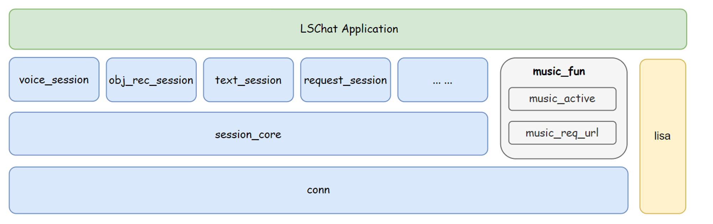

.. _index :

====================================
LSCHAT
====================================

简介
-------------------------------------

LSCHAT是由聆思科技提供一套跨平台的SDK, 封装了一系列与聆思云端交互能力，可让项目快速接入聆思云端大模型。

- conn: 负责云端的连接和数据收发
- session_core: 负责会话管理，数据打包和解析
- xx_session: 负责实例化会话具体行为，包含启动，停止，发送数据，监听关联事件等
- lisa: 跨平台标准接口，提供一系列跨平台的基础能力

能力
------------------------------
- 物体识别
- 文生图
- 音乐播控
- 闲聊
- TTS合成

已支持的平台
-------------------------------
- zephyr
- linux

.. note::

   跨平台能力由lisa组件提供，具体细节见lisa组件。

.. toctree::
   :maxdepth: 1
   :caption: 目录

   getting_started.rst
   api.rst
   samples/samples.rst
